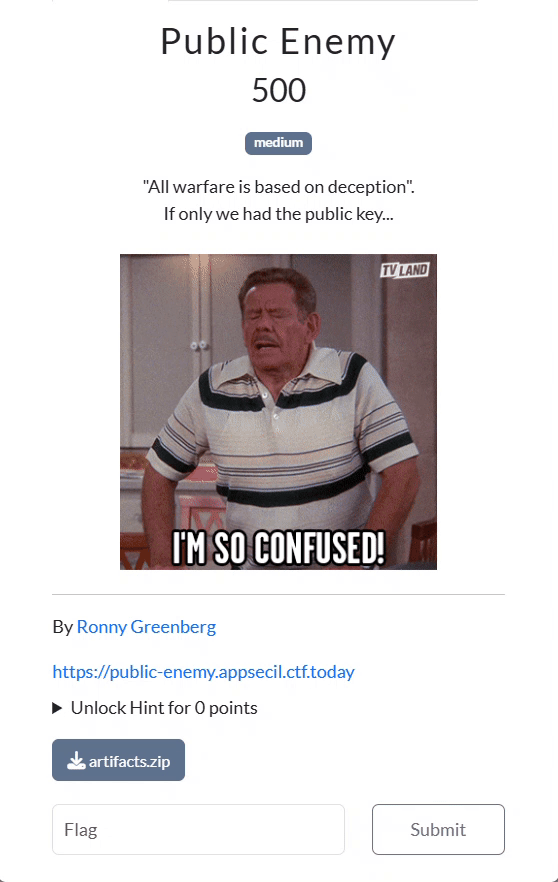
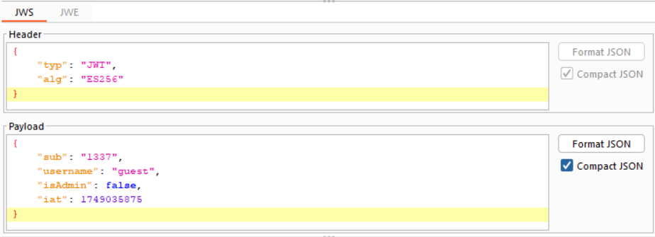
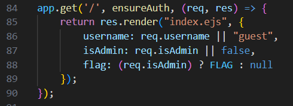
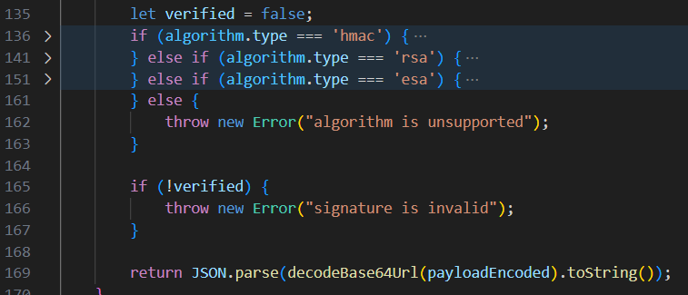
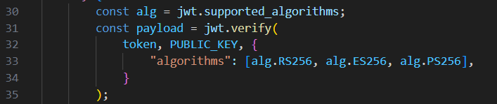
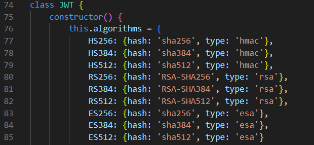
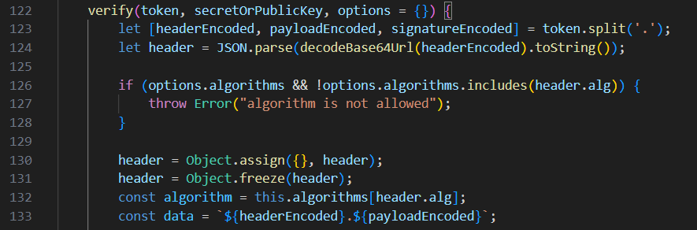
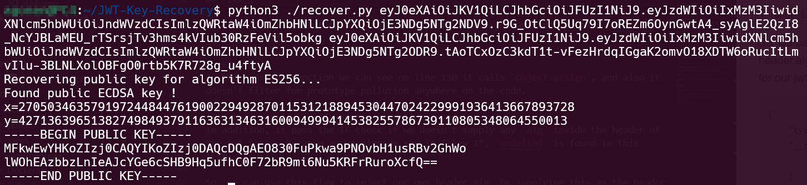
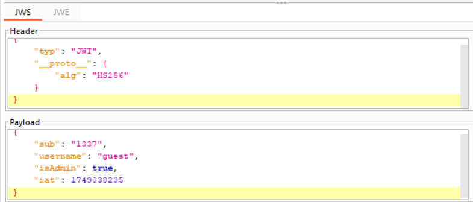
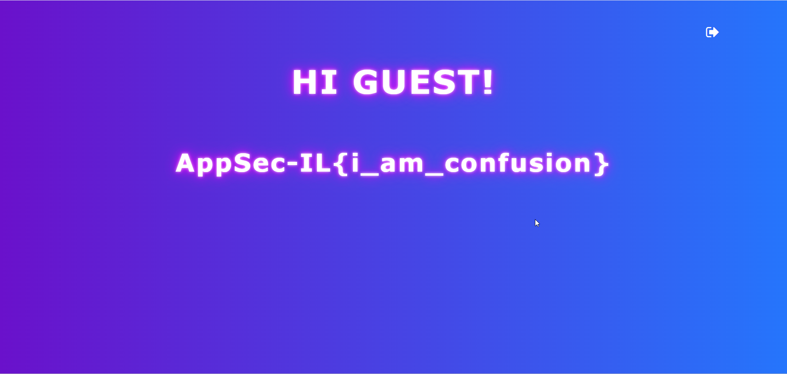

# Public Enemy

- **Category:** Web  
- **Points:** 500  
- **Solved by:** JCTF Team

---

## Description



The challenge lets users log in and uses JWT to maintain session cookies. It's vulnerable to an algorithm confusion attack mixed with prototype pollution.

---

## Solution

First, we log in as guest with `guest` as username and password. This is the JWT token we got: 


As we can see, it holds our username and also the `isAdmin` field. From the source code, in the file `index.js`, we need to somehow be the admin in order to view the `FLAG`.
```js
app.get('/', ensureAuth, (req, res) => {
    return res.render("index.ejs", {
        username: req.username || "guest",
        isAdmin: req.isAdmin || false,
        flag: (req.isAdmin) ? FLAG : null
    });
});
```
<!--  -->

If we observe the code, we can see it accepts 3 algorithms: `HMAC`, which is symmetric, and `RSA` and `ESA`, which are asymmetric. 
```js
let verified = false;
if (algorithm.type === 'hmac') { ... } 
else if (algorithm.type === 'rsa') { ... } 
else if (algorithm.type === 'esa') { .... } 
else {
    throw new Error("algorithm is unsupported");
}
```
<!--  -->

The `sign` function and the `verify` function are well implemented, so trying to push `none` as the algorithm type in the JWT token won't work.

## Flaw 1
However, we can detect a flaw here: in the supported algorithms in file `index.js` it mentions `PS256`, while in `jwt.js` it mentions `HS256`, and not `PS256`. 
```js
const alg = jwt.supported_algorithms;
const payload = jwt.verify(
    token, PUBLIC_KEY, {
        "algorithms": [alg.RS256, alg.ES256, alg.PS256],
    }
);
```
```js
this.algorithms = {
            HS256: {hash: 'sha256', type: 'hmac'},
            HS384: {hash: 'sha384', type: 'hmac'},
            HS512: {hash: 'sha512', type: 'hmac'},
            RS256: {hash: 'RSA-SHA256', type: 'rsa'},
            RS384: {hash: 'RSA-SHA384', type: 'rsa'},
            RS512: {hash: 'RSA-SHA512', type: 'rsa'},
            ES256: {hash: 'sha256', type: 'esa'},
            ES384: {hash: 'sha384', type: 'esa'},
            ES512: {hash: 'sha512', type: 'esa'}
        }
```
<!--  -->
<!--  -->

So, the algorithm list that is being passed to the `verify` function contains `undefined`. This might help us.

## Flaw 2
In the `verify` function, we can see on line 130 it calls `Object.assign` on the `JWT header`, since the JWT header is user-controlled and not properly filtered, an attacker can supply malicious properties (like `__proto__`) in the header, enabling prototype pollution.

```js
let header = JSON.parse(decodeBase64Url(headerEncoded).toString());

if (options.algorithms && !options.algorithms.includes(header.alg)) {
    throw Error("algorithm is not allowed");
}

header = Object.assign({}, header);
header = Object.freeze(header);
const algorithm = this.algorithms[header.alg];
```
<!--  -->
In addition, it passes the IF check if we don't supply any `alg` inside the header of the JWT token, because as we already saw in *Flaw 1*, `undefined` is found in this list.  

So, we can use this flaw to inject our own header.alg, by supplying this as the header for our JWT token.
```json
{
    "typ": "JWT",
    "__proto__": {
        "alg": "HS256"
    }
}
```

## Flaw 3

All we need for our algorithm confusion attack is to obtain the `public key`. We use the tool [JWT-Key-Recovery](https://github.com/FlorianPicca/JWT-Key-Recovery) from GitHub, and extract the `public key` by supplying 2 JWT tokens.
 

 ---

 ## Attack

We need to change the header and the payload. In the header, we use *Flaw 1* and *Flaw 2* in order to use `HS256`, which is a symmetric algorithm, and in the payload we set the `isAdmin` flag to true. 



All that's left is to sign this token with the `public key` we obtained in *Flaw 3*. Notice it might be frustrating—the format of the key, new lines might jump. 
I changed the source code of the `recover.py` and printed the `PEM key` already base64 encoded.

> Alternatively, you can use `openssl` to convert the PEM public key to the required format. For example:
> ```
> openssl ec -pubin -in out.pem | base64 -w 0
> ```
> (Make sure to adjust the command and file names as needed for your key type.)



The flag is `AppSec-IL{i_am_confusion}`