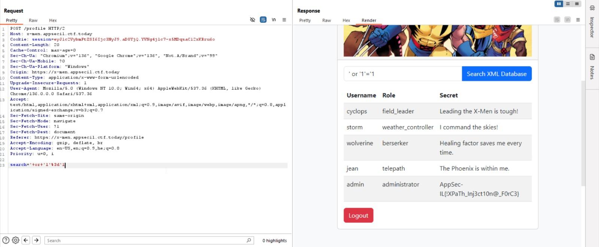

# X-Men

- **Category:** Web  
---

The challenge is about XPath injection.

I basically injected this payload `' or '1'='1`, and by this way so all the users.
Very similar to SQLi

Here you can see the final image using burp suite

The flag is `AppSec-IL{!XPaTh_Inj3ct10n@_ForC3}`