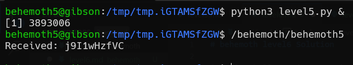

# behemoth level6 Solution

in this challenge i wrote simple script that creates UDP socket that tries to listen to localhost:1337
[level5.c]
```python
% scripts/level6.py
```





**Flag:** ***`j9I1wHzfVC`*** 
