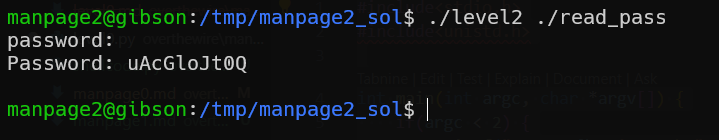

# manpage level2 Solution

in this level we can exploit the fact it leaves the file open, and also we can execute our code using the last line that reruns the file, with `excel`.
this will be our solution [level2.c](./scripts/level2/level2.c), while this is the file we'll give as input [read_pass.c](./scripts/level2/read_pass.c)

**Flag:** ***`uAcGloJt0Q`*** 
