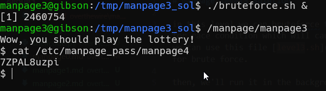

# manpage level3 Solution

in this level we can bruteforce the reset password, and hope for race condition which will cause the password to be empty. we can use this file [level3.sh](./scripts/level3/level3.sh) for brute force.

then, we'll run it in the background and try giving empty string, by entering *ctrl-D*.

**Flag:** ***`7ZPAL8uzpi`*** 
