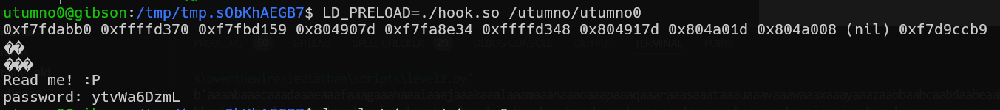

# utumno level0 Solution

when i run the file, it says to read it, however i don't have read permissions. so, i decided to try hooking the file, using hooking the put function.

After i saw the hooking works, i read the stack using `printf("%p %p %p %p %p %p %p %p\n")`, and then i saw addresses that starts with `0x804`, maybe indicates on local variables on the stack, that might contain the password.
```c
% scripts/hook.c
```
, you need to adjust the addresses on the stack of the (maybe) local variables.

the commands for compiling and linking the so file, here.
```
gcc -m32 -shared -fPIC -o hook.so hook.c -ldl
LD_PRELOAD=./hook.so /utumno/utumno0
```



**Flag:** ***`ytvWa6DzmL`*** 
