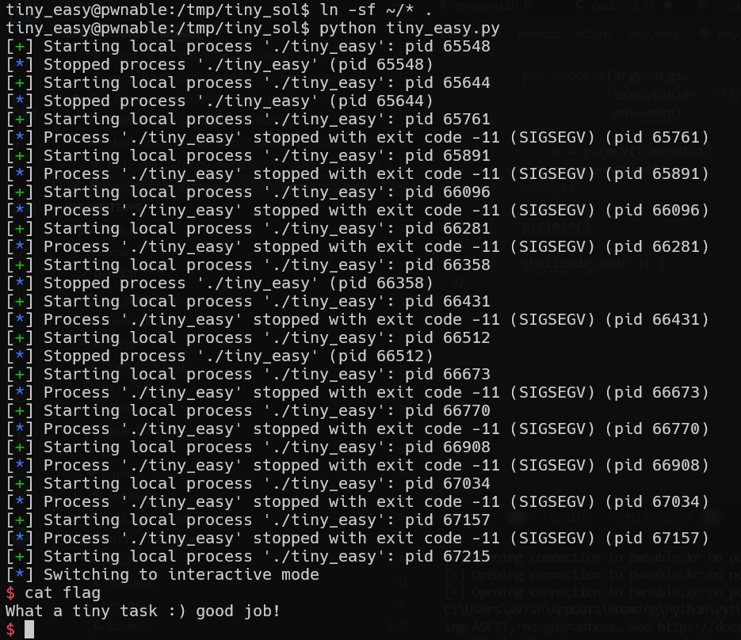

# tiny_easy Solution

in this challenge, we spam the stack with our shellcode, and hope that in arg1 we'll put address that'll fall exactly on NOP bytes, and by this way execute our shellcode.

```py
% scripts/tiny_easy.py
```




**Flag:** ***`What a tiny task :) good job!`***
