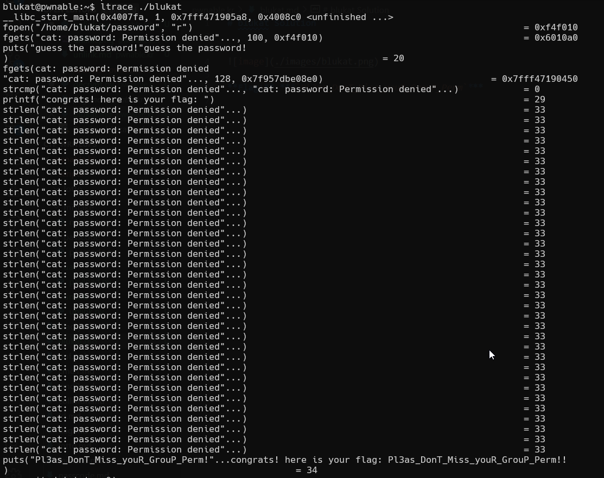

# blukat Solution

i saw that it doesn't check whether it can open the file. When it fails, it submit this string to password: `cat: password: Permission denied` (with \n)
Let's try give this as password.
It works!

**Flag:** ***`Pl3as_DonT_Miss_youR_GrouP_Perm!!`***
