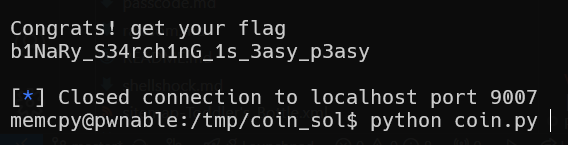

# coin Solution

in this challenge we need to do binary search, multiple times, until we answer to all of the questions.
```py
% scripts/coin.py
```
 


**Flag:** ***`b1NaRy_S34rch1nG_1s_3asy_p3asy`***
