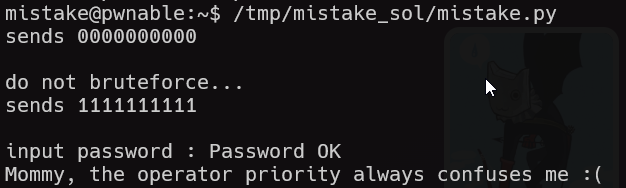

# mistake Solution

in this challenge the error lies in the fact it reads the password from stdin, because the compare happens before the assignment when it opens the password file for reading.

```py
% scripts/mistake.py
```




**Flag:** ***`Mommy, the operator priority always confuses me :(`***
