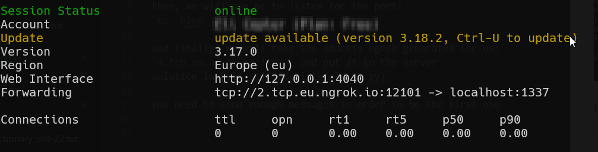
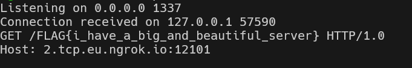

# Webhacking old-31 Solution

in this challenge we will open port for the public internet using ngrok.
`ngrok tcp 1337`

then, we will use nc to listen for the port:
`nc -nlvp 1337`

and finally, we will take the address ngrok generated for us:
`2.tcp.eu.ngrok.io:12101` and put it in the server

**Flag:** ***`FLAG{i_have_a_big_and_beautiful_server}`*** 

