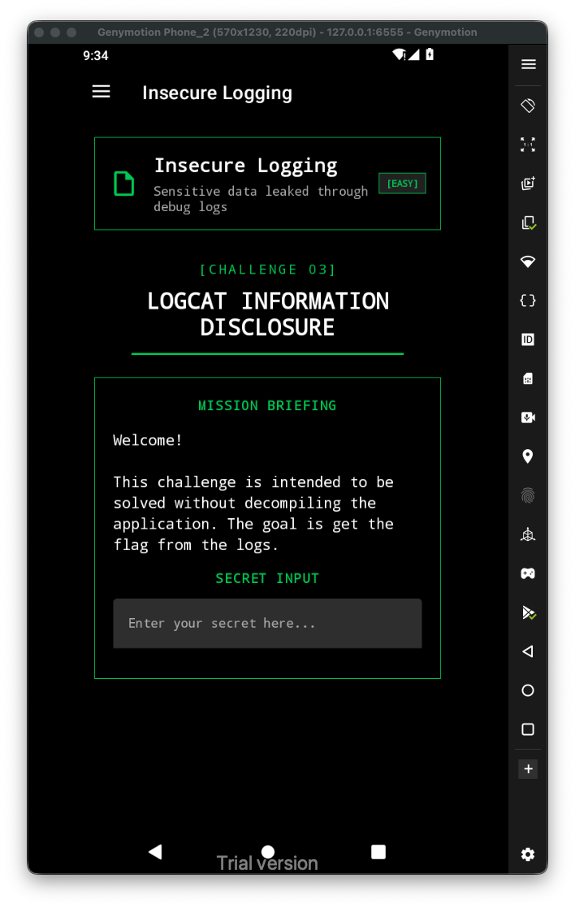
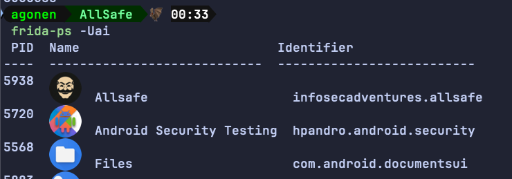
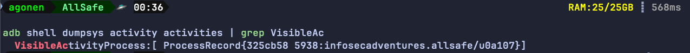
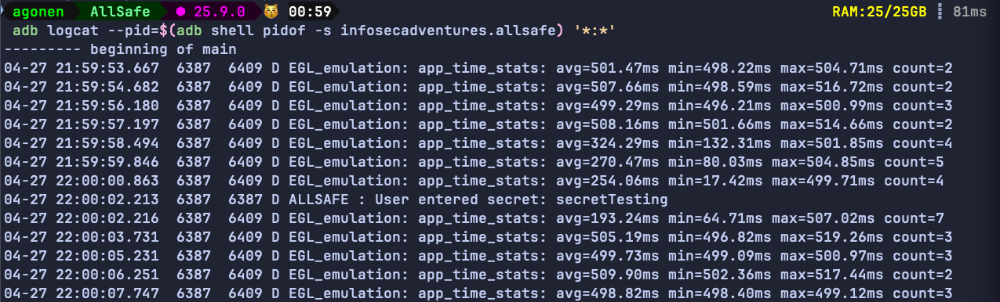
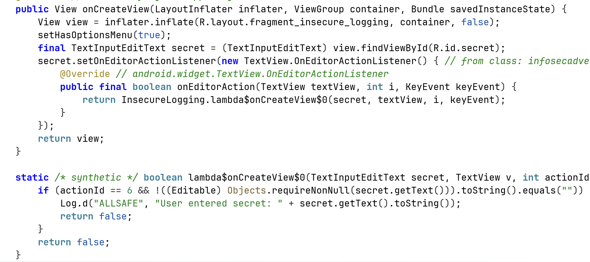
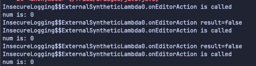

Let's start by viewing the challenge:


The goal is it says is to grab the flag from the logs. 
First, we need to find the package name, for that we can use `frida-ps -Ua`:



Another way will be to see the visible activity process:

```bash
adb shell dumpsys activity activities | grep VisibleAc
```



Anyway, the package name is `infosecadventures.allsafe`, so the command will be:
```bash
adb logcat --pid=$(adb shell pidof -s infosecadventures.allsafe) '*:*'
```



Notice, it should work, however it didn't worked for me... I checked the source code;



We can se it wants actionId to be 6. After checking with frida, using this script, I found this is always 0. So, I manually changed it to 6, using the injection:

```js
Java.perform(function(){

    var InsecureLogging$$ExternalSyntheticLambda0 = Java.use("infosecadventures.allsafe.challenges.InsecureLogging$$ExternalSyntheticLambda0");
InsecureLogging$$ExternalSyntheticLambda0["onEditorAction"].overload('android.widget.TextView', 'int', 'android.view.KeyEvent').implementation = function (view, num, keyEvent) {
    console.log(`InsecureLogging$$ExternalSyntheticLambda0.onEditorAction is called`);
    console.log("num is: " + num)
    let result = this["onEditorAction"](view, 6, keyEvent);
    console.log(`InsecureLogging$$ExternalSyntheticLambda0.onEditorAction result=${result}`);
    return result;
};

})
```



