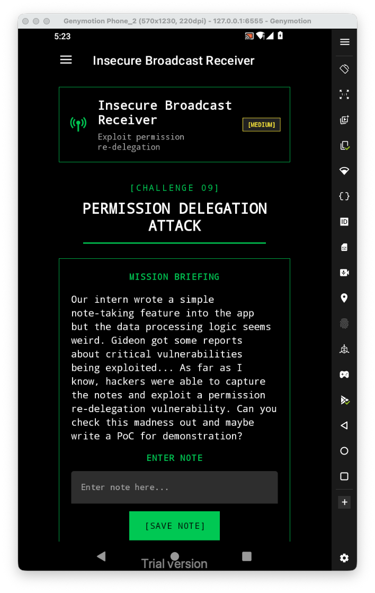
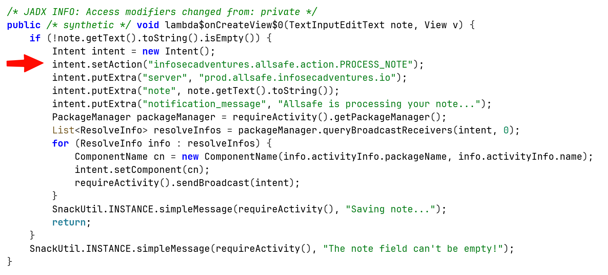
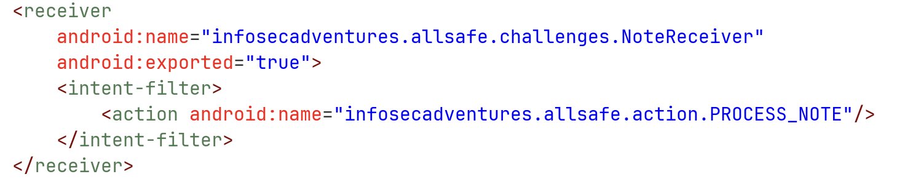
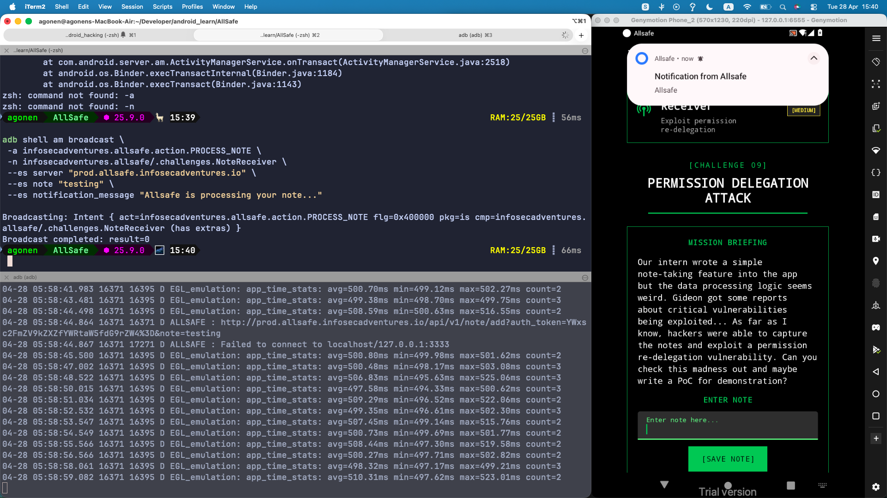
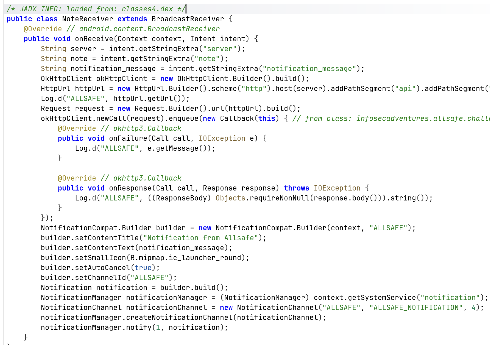

Let's first have a look at the challenge:


Inside the source code, we can see that when creating note, we send some intent with the action `infosecadventures.allsafe.action.PROCESS_NOTE`



I searched inside `AndroidManifest.xml`, we can see this exported receiver that process this exact action.



When looking at the class, we can see this is actually the receiver, and it is also exported. So, we can easily create intent with all the keys it put inside. Notice that at the code, it both uses the action, as `implicit` intent, and also sends to the only activites that has broadcast receivers which can handle the exact intent activity. So, it uses both `implicit` and `explicit` intent.

Let's use adb:

```bash
 adb shell am broadcast \
 -a infosecadventures.allsafe.action.PROCESS_NOTE \
 -n infosecadventures.allsafe/.challenges.NoteReceiver \
 --es server "prod.allsafe.infosecadventures.io" \
 --es note "testing" \
 --es notification_message "Allsafe is processing your note..."
```



We can see the request was send, and also inside the log we can see the URL we requested.



