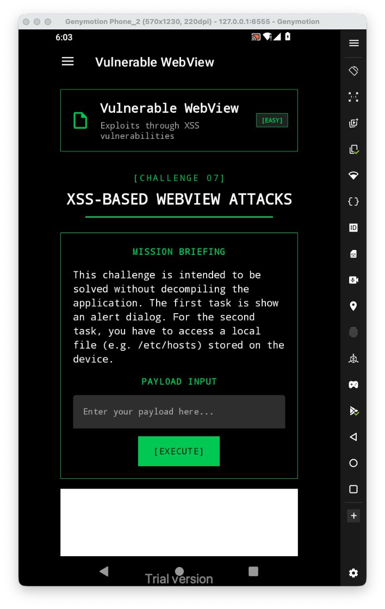
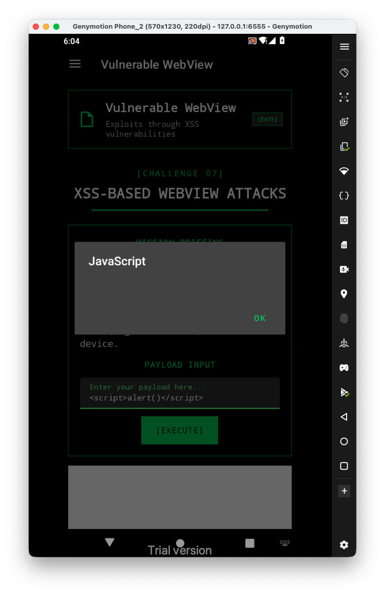
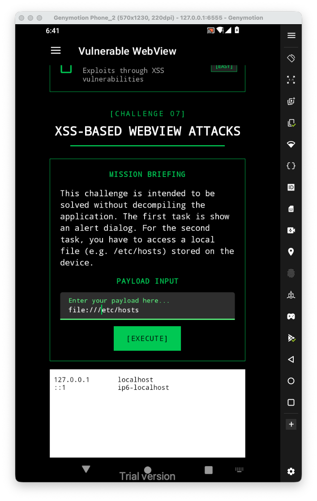
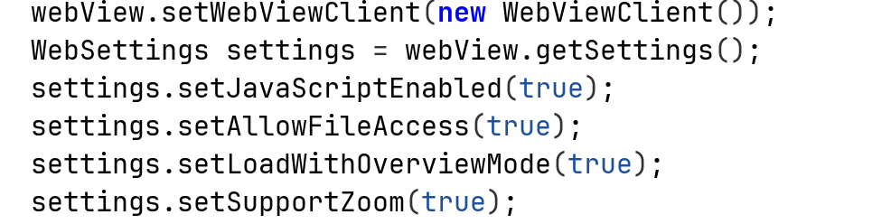

Let's first have a look at the challenge:

For the first task, let's try to give xss payload, like ``:

Let's try to access some file, using `file:///etc/hosts`:

It worked because there are so many flags that are set to true:

