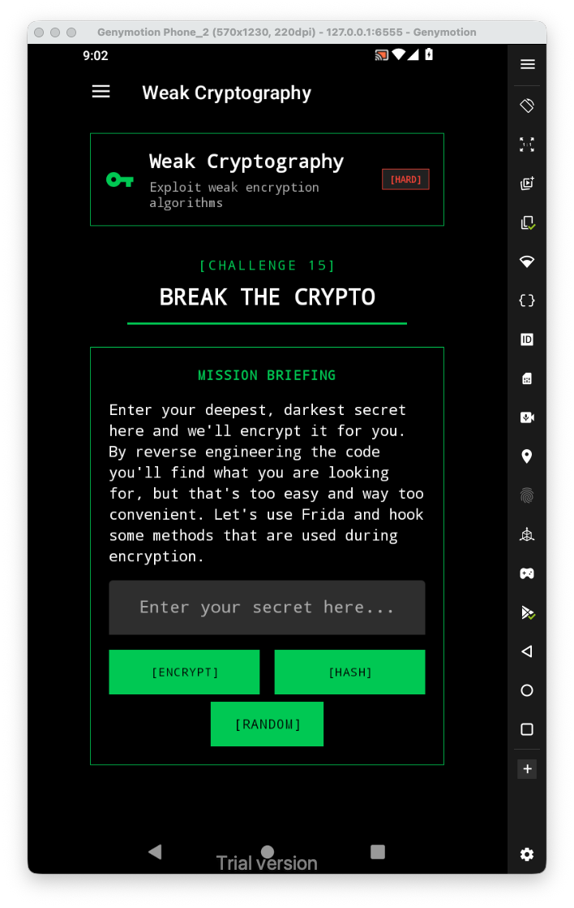
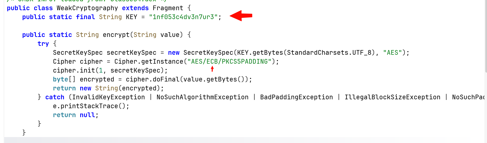
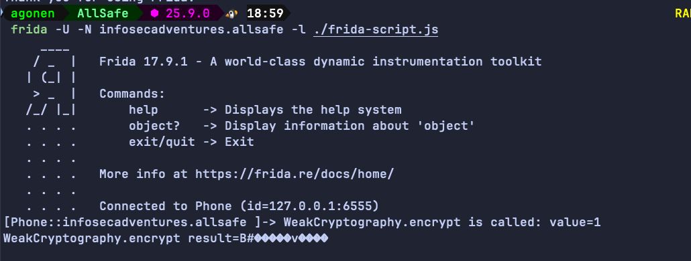

Let's first have a look at the challenge:



Here, we can see several weak methods.



First, it have hardcoded key. In addition, it uses `AES` which is fine, but in `ECB`mode, which is very vulnerable, remember the tux image.


We can use frida to hook the messages, for example, hook the string a moment before it get encrypted:

```js
Java.perform(function(){
    var WeakCryptography = Java.use("infosecadventures.allsafe.challenges.WeakCryptography");
    WeakCryptography["encrypt"].implementation = function (value) {
        console.log(`WeakCryptography.encrypt is called: value=${value}`);
        let result = this["encrypt"](value);
        console.log(`WeakCryptography.encrypt result=${result}`);
        return result;
    };
})
```

For example, when trying to encrypt the string `1`:



