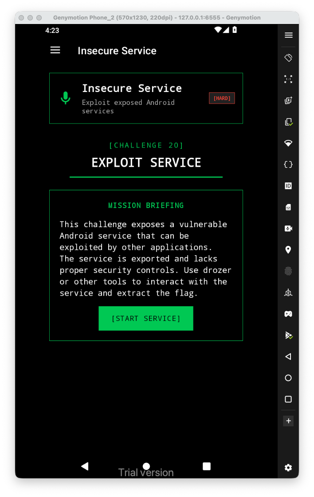
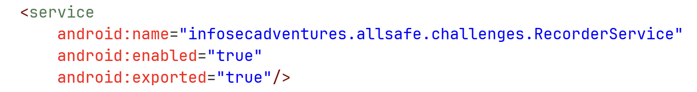
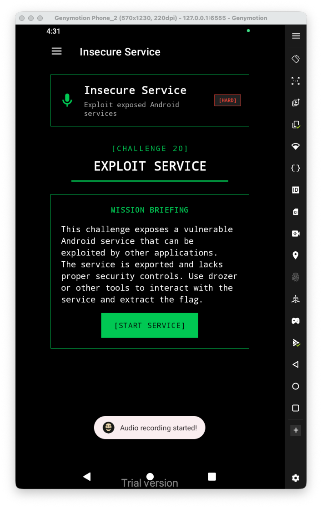
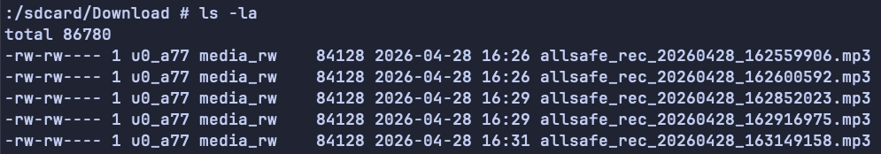

Let's first have a look at the challenge:


When we check the `AndroidManifest.xml`, we can see this `RecorderService`, which can be exported:



We can trying to start this service manually, using `adb`:

```bash
adb shell am startservice infosecadventures.allsafe/.challenges.RecorderService
```



We got audio recording, we can check at `/sdcard/Download`:



The vulnerability here is that every app or piece of code that running on the phone, can request this recording. 