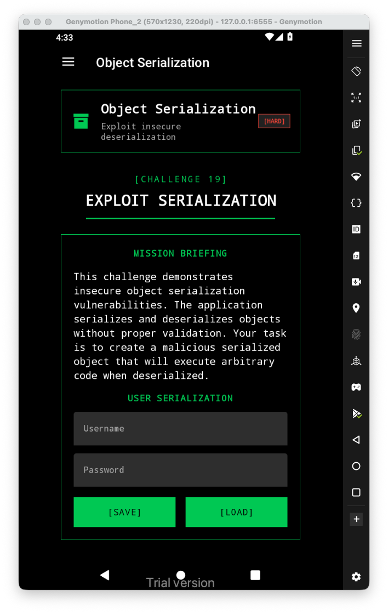
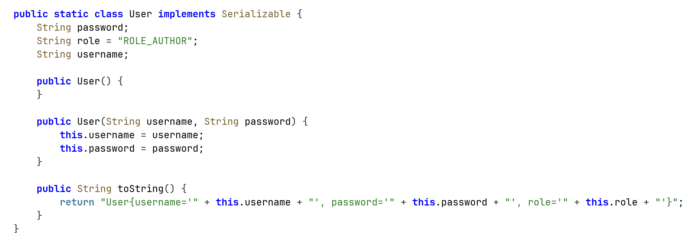
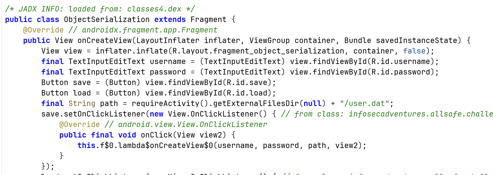
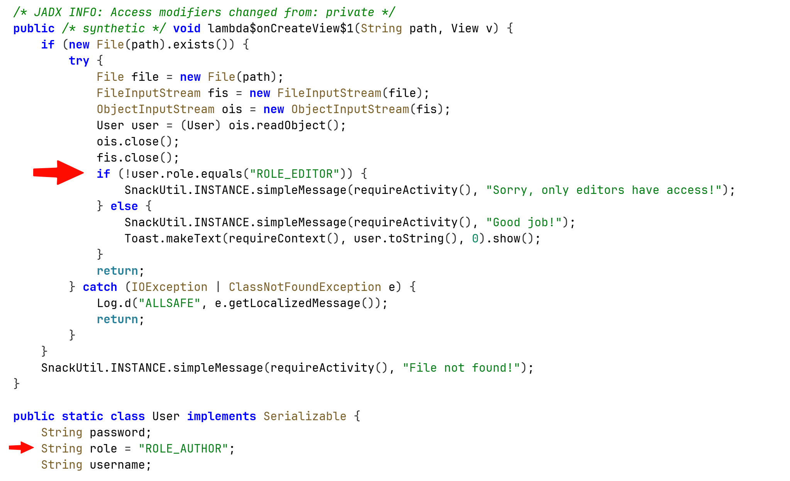
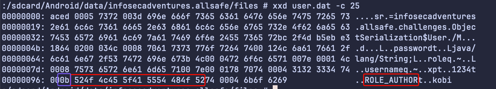
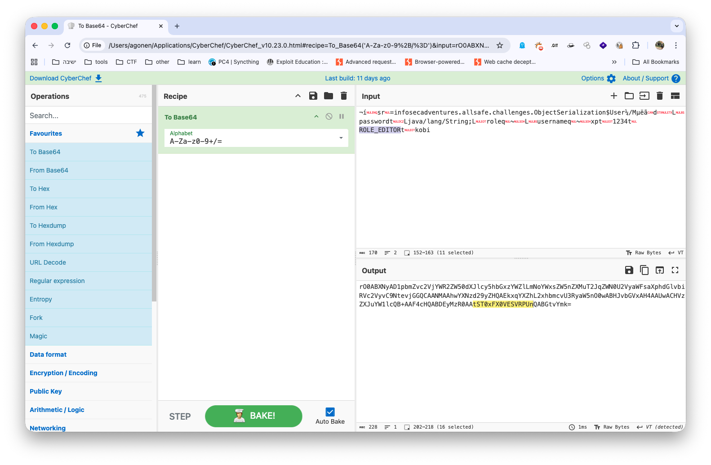
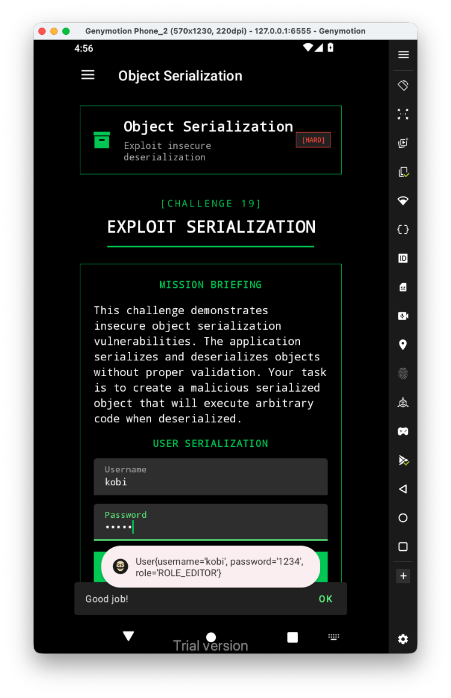

Let's first have a look at the challenge:


When we save input, it creates the class `User`:



And save its serialized object to `/sdcard/Android/data/infosecadventures.allsafe/files/user.dat`



Then, when loading the data back, it checks if our role is `ROLE_EDITOR`, which isn't, since it is `ROLE_AUTHOR`:



So, we have two ways to solve it. 

A. create some java snippet code, where we serialize the object User with the desired role, and save it to the `user.dat`.

B. Analyze the file itself, and brutally edit it :)



We can see that it has the length of the string, and then the string itself. 
What if we'll simply edit it? we can change also the length (which we don't need, because the strings are at the same length...)

So, let's copy this after encoding it to base64 into *CyberChef*:



Then, We can edit it to be `ROLE_EDITOR`, we got some base64 string. let's put it back inside the file:

```bash
echo -e 'rO0ABXNyAD1pbmZvc2VjYWR2ZW50dXJlcy5hbGxzYWZlLmNoYWxsZW5nZXMuT2JqZWN0U2VyaWFsaXphdGlvbiRVc2VyvC9NtevjGGQCAANMAAhwYXNzd29yZHQAEkxqYXZhL2xhbmcvU3RyaW5nO0wABHJvbGVxAH4AAUwACHVzZXJuYW1lcQB+AAF4cHQABDEyMzR0AAtST0xFX0VESVRPUnQABGtvYmk=' | base64 -d > /sdcard/Android/data/infosecadventures.allsafe/files/user.dat
```

Now, lets load the data:


