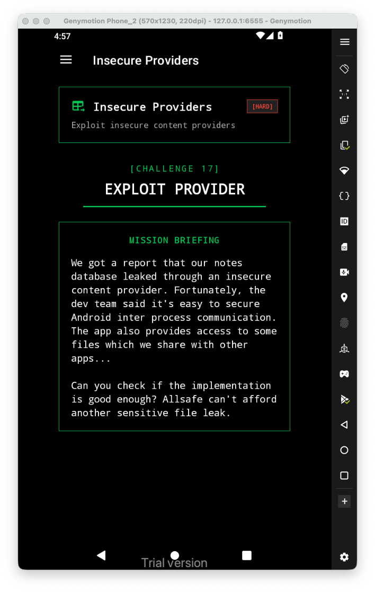
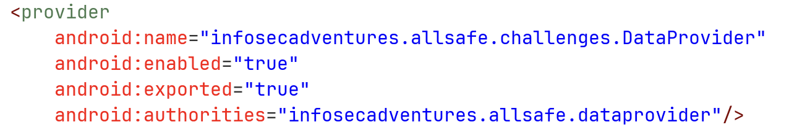
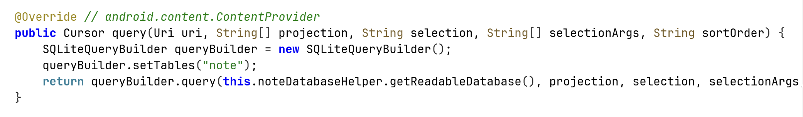
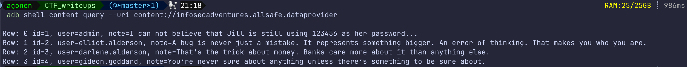

Let's first have a look at the challenge:


When looking at `AndroidManifest.xml`, we can see there is an exported content provider named `DataProvider`:



When getting down into the source code, we can see that if it gets request of `query`, it simply sends it to the sqlite helper:



Let's send query request to this host:

```bash
adb shell content query --uri content://infosecadventures.allsafe.dataprovider
```



I got the full table, because when `projection` is null, it interprets it as `*`.

We could have the same result, using the next line:

```bash
adb shell content query --uri content://infosecadventures.allsafe.dataprovider --projection '"*"'
```

Anyway, because this is exported, and also the query is misconfigured, we can get the whole db.