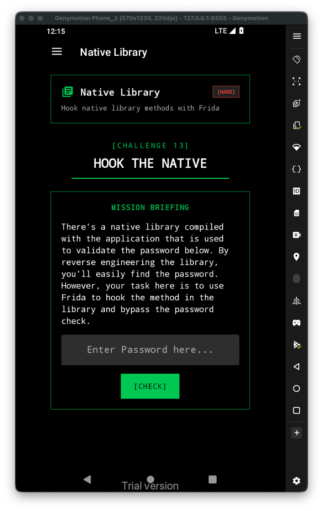
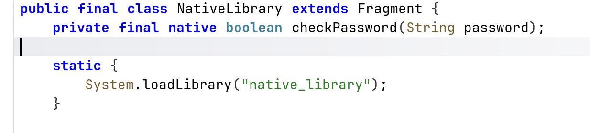
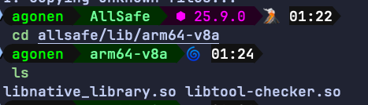
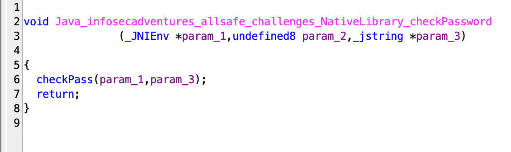
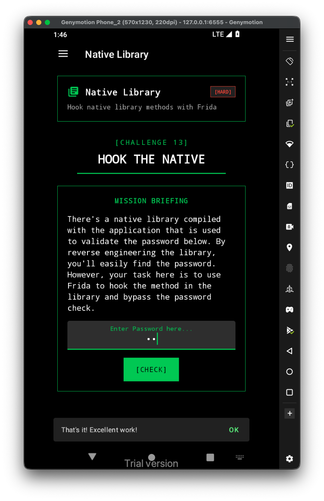

Let's first have a look at the challenge:



First, let's extract the binaries from the `apk`:

```bash
apktool d allsafe.apk -o allsafe/
```



It loads the function `checkPassword` from the file `libnative_library.so`, let's grab this file. Remember to take the one that correspond to your emulator architecture:



I opened this `libnative_library.so` inside *Ghidra*:



Let's hook this function, and change the return value to true.

```js
Java.perform(function(){
    const checkPass_address = Process.findModuleByName("libnative_library.so").findExportByName("Java_infosecadventures_allsafe_challenges_NativeLibrary_checkPassword");
    Interceptor.attach(checkPass_address, {
        onLeave: function(retval){
            retval.replace(1);
        }
    })

})

```

Now, Execute with frida: 

```bash
frida -U -N infosecadventures.allsafe -l ./frida-script.js
```

