Let's first have a look at the challenge:

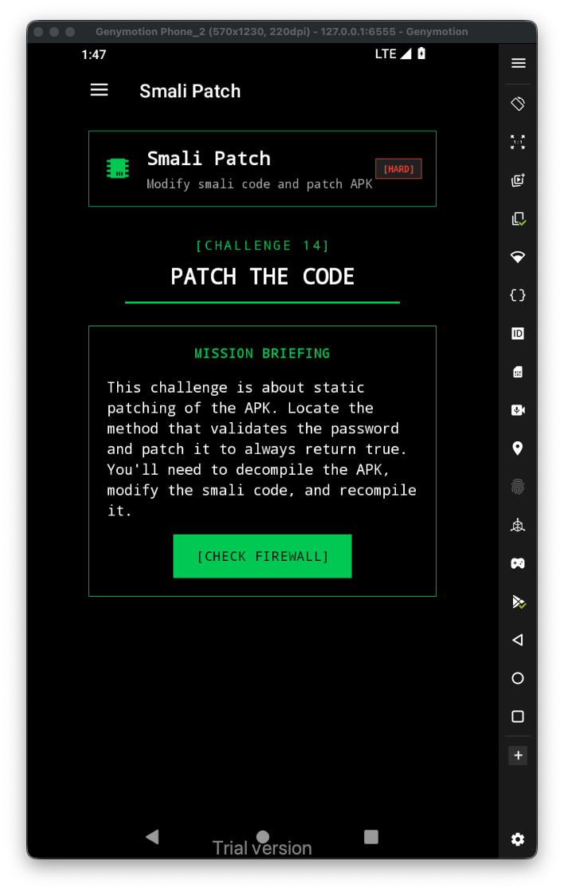

This is the code in java:

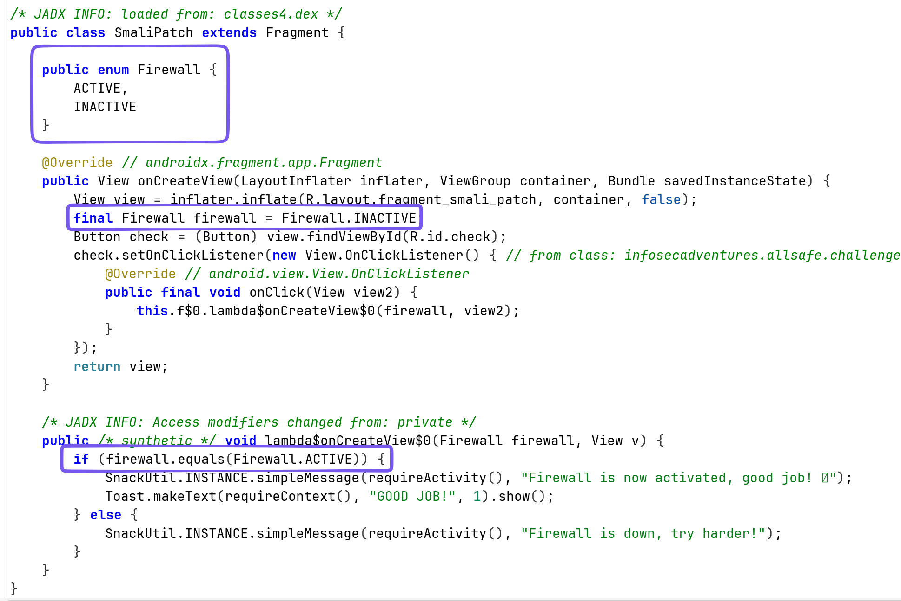

It sets the `Firewall` to `INACTIVE`, and then checks if it `ACTIVE`.

In the smali code, we can do 2 things:

1. Change the `if-eqz`, to `if-ne`, and then the check will pass

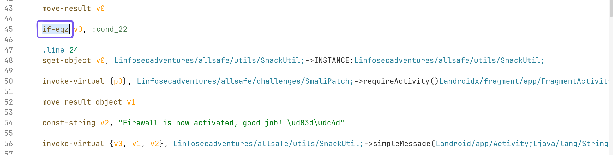

2. Change the value of firewall from `INACTIVE` to `ACTIVE`

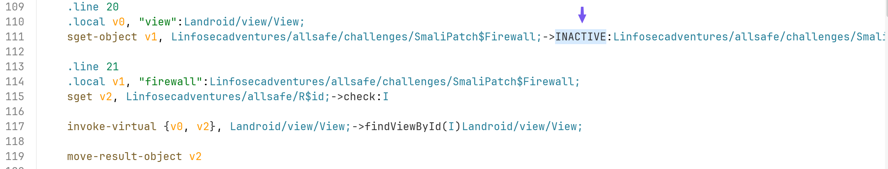

I want to change the `INACTIVE` to `ACTIVE`.

So, first step is to decompile the apk:

```bash
apktool d allsafe.apk -o allsafe/
```

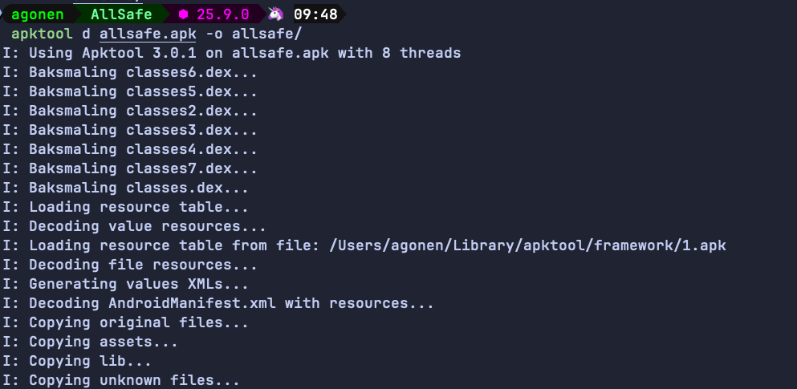

Then, we want to find the smali file of the class `SmaliPatch`:

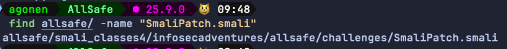

So, let's edit this file:

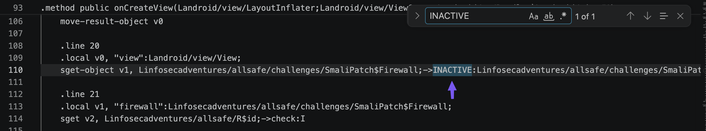

I changed it to `ACTIVE`, and saved the file. Now, we need to compile the data back into apk, align the apk and sign it.

```bash
apktool b allsafe -o modified_allsafe.apk
```

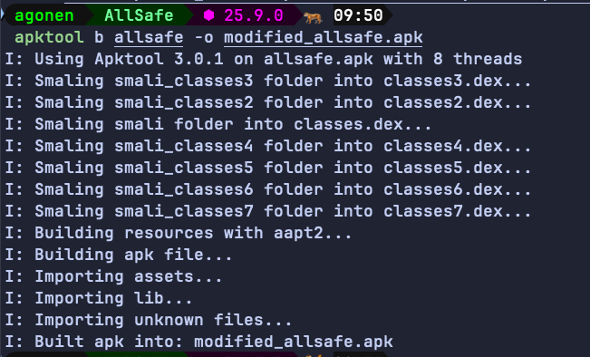

Now, create the keystore for the application signing:

```bash
keytool -genkeypair \
  -keystore key.keystore \
  -storepass password \
  -keypass password \
  -alias john \
  -keyalg RSA \
  -keysize 2048 \
  -validity 1000 \
  -dname "CN=John Doe, OU=Test, O=Test, L=Test, S=Test, C=US"
```

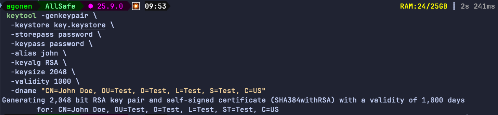

Then, we need to align the apk, before we sign it. Notice we'll use tools from the android sdk, they can be located at `~/Library/Android/sdk/build-tools/<version>/`.

```bash
~/Library/Android/sdk/build-tools/37.0.0/zipalign -p -f -v 4 modified_allsafe.apk allsafe_aligned.apk
```

Next, we need to sign the aligned apk:

```bash
~/Library/Android/sdk/build-tools/37.0.0/apksigner sign \
  --ks key.keystore \
  --ks-pass pass:password \
  --key-pass pass:password \
  allsafe_aligned.apk
```

We can verify that this apk is actually signed:

```bash
~/Library/Android/sdk/build-tools/37.0.0/apksigner verify --verbose allsafe_aligned.apk
```

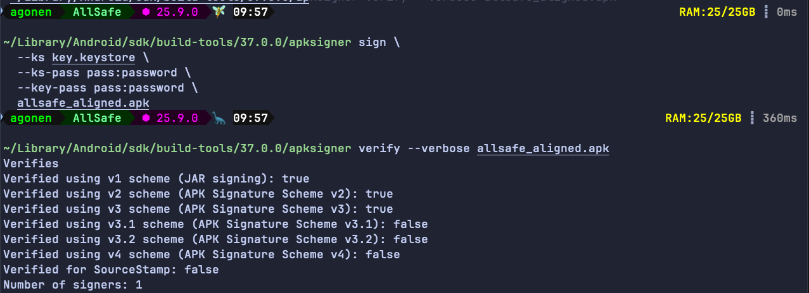

Finally, let's install this apk, after uninstalling the original apk:

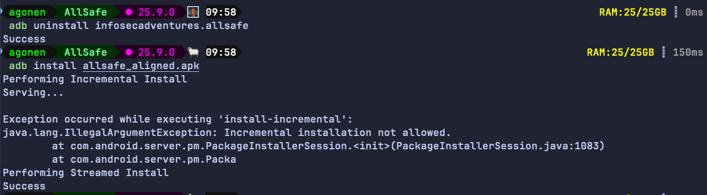

Will it work?

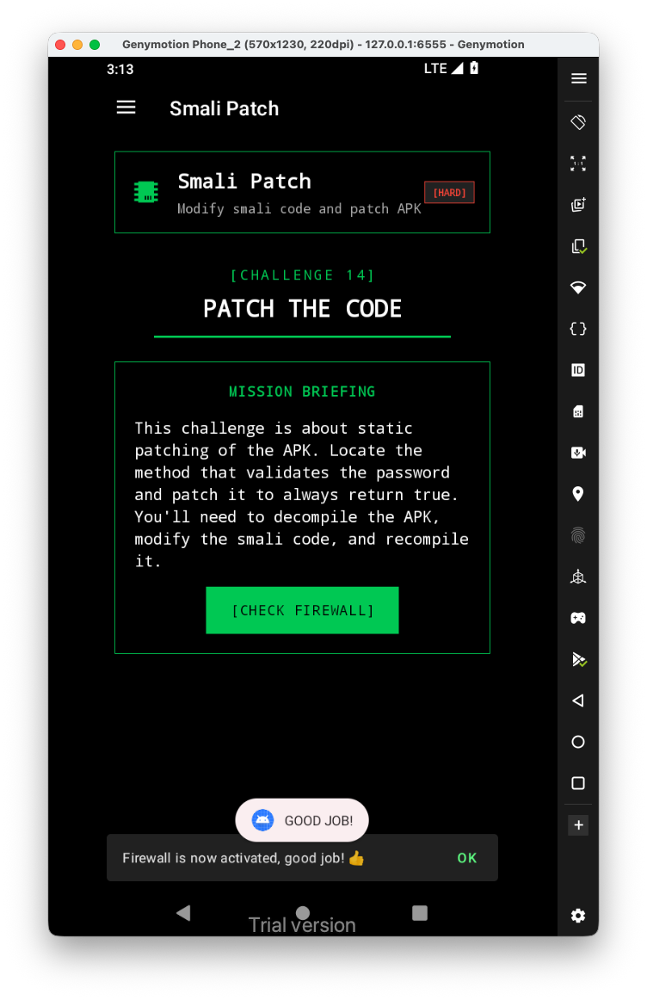

Yep, it worked :D