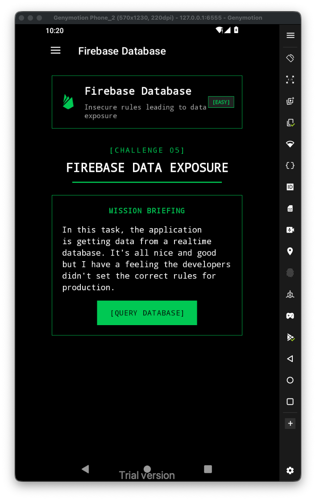
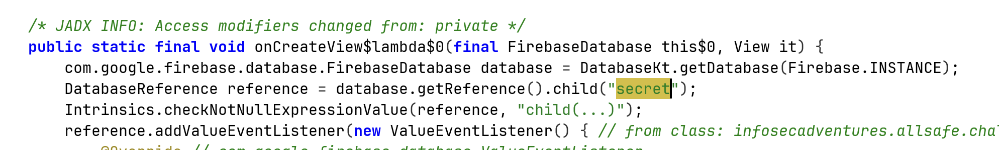
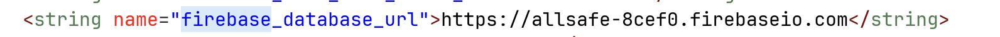
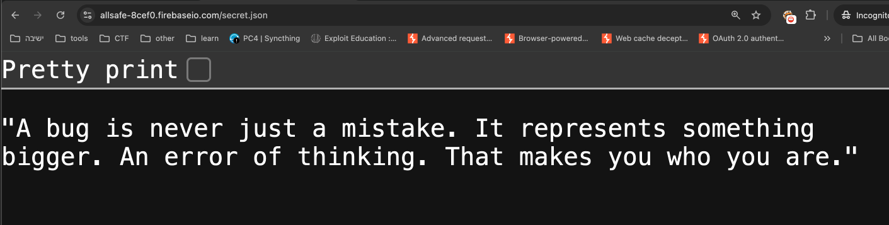

Let's first have a look at the challenge:

Inside the source code, we can see it tries to access the path `/secret`, on the remote firebase:

Let's find the url of the firebase, located at `/values/strings.xml`

So, the full url is `https://allsafe-8cef0.firebaseio.com/secret.json`

