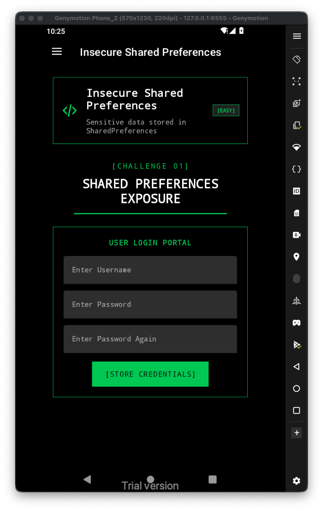
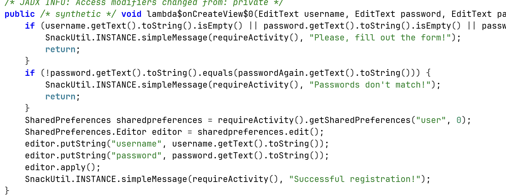
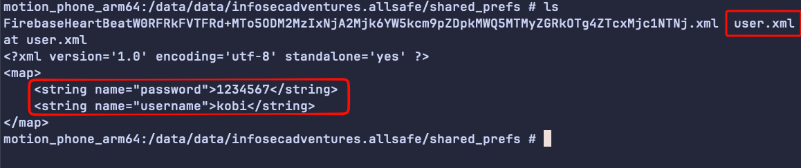

Let's first have a look at the challenge:

When we look at the code, we can see it saves the credentials in none encrypted shared preferences:

We can find this file in the internal storage of the application, the filename is `user.xml`:

