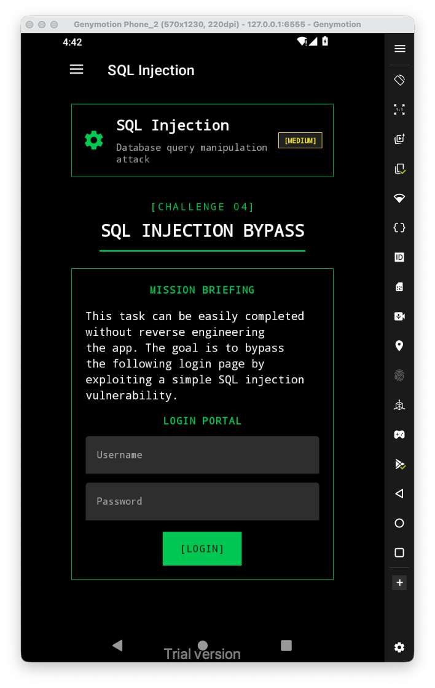
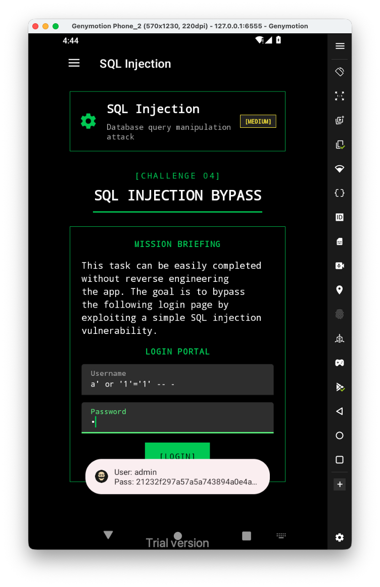

Let's first have a look at the challenge:

It tried this payload as username `a' or '1'='1' -- -`:

We can see we actually got logged in as `admin`, and got the password which looks like some hash.

