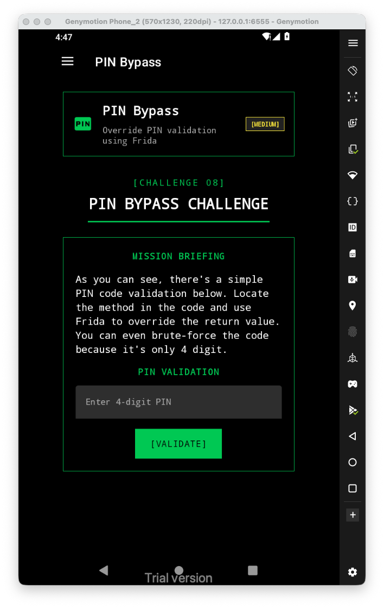
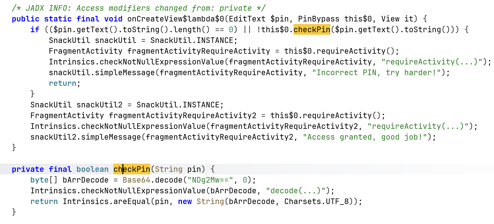
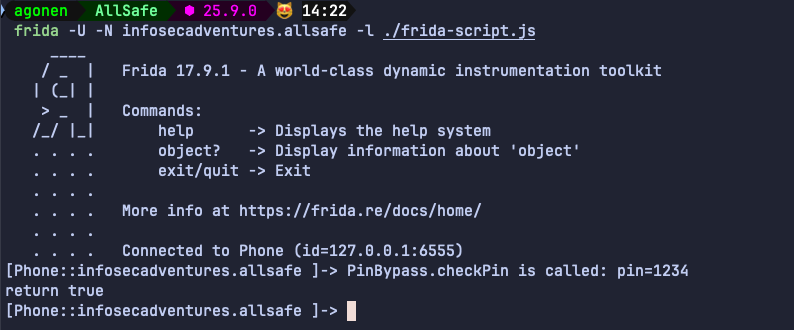
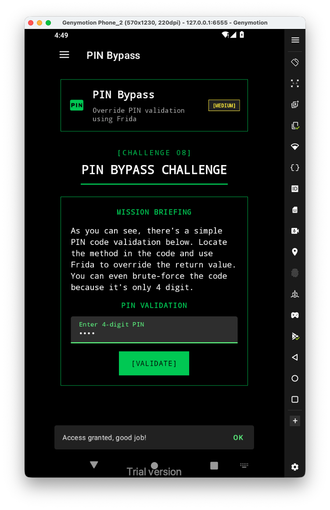

Let's first have a look at the challenge:



Inside the source code we can see the function `checkPin` that checks the pin we input:



Let's hook it using frida:

```js
Java.perform(function(){

    var PinBypass = Java.use("infosecadventures.allsafe.challenges.PinBypass");
    PinBypass["checkPin"].implementation = function (pin) {
        console.log(`PinBypass.checkPin is called: pin=${pin}`);
        let result = this["checkPin"](pin);
        console.log(`return true`);
        return true;
    };
})
```



And then, we can see that we got access granted:


