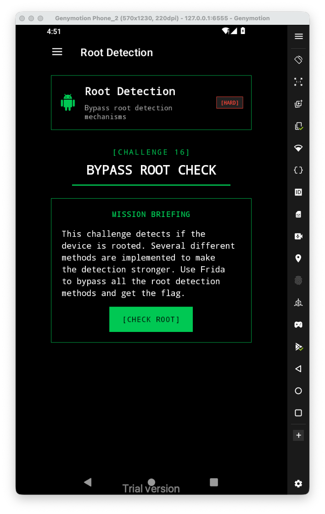
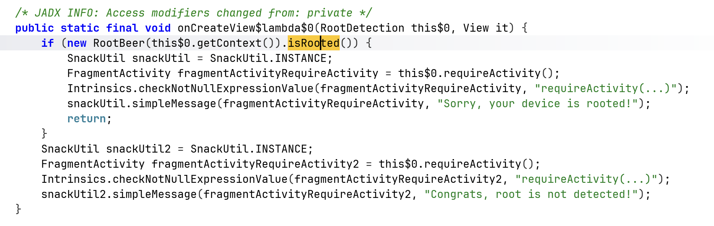
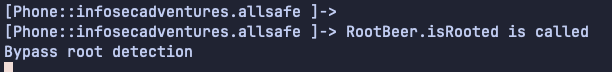
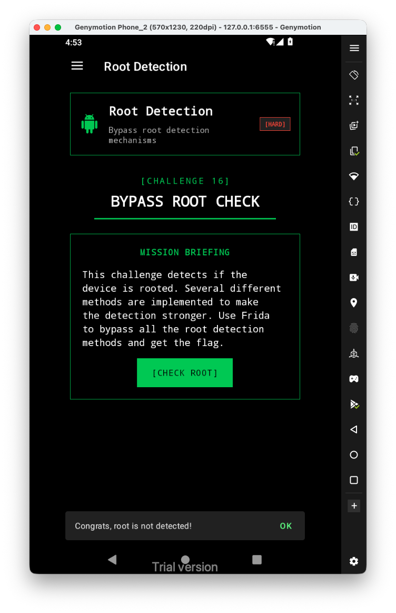

Let's first have a look at the challenge:



It uses some well known which is called `RootBeer`:



Let's simply hook the function `isRooted`:

```js
Java.perform(function(){
    var RootBeer = Java.use("com.scottyab.rootbeer.RootBeer");
    RootBeer["isRooted"].implementation = function () {
        console.log(`RootBeer.isRooted is called`);
        let result = this["isRooted"]();
        console.log('Bypass root detection');
        return false;
    };
})
```



And we got the root detection bypassed

