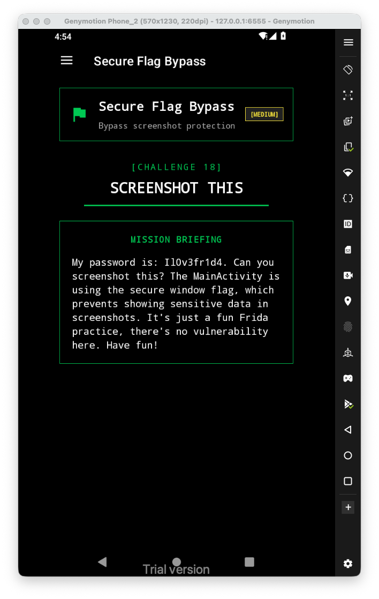
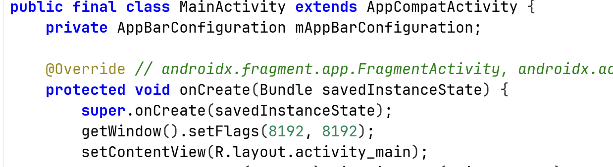
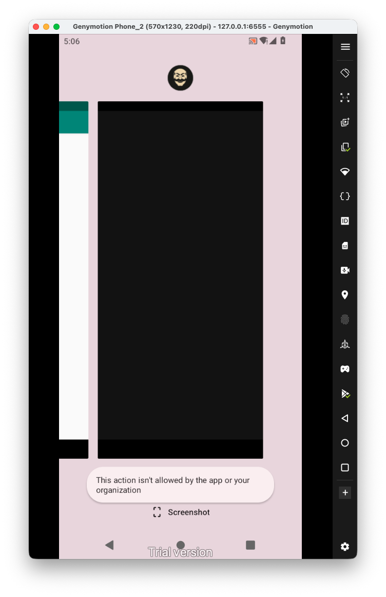
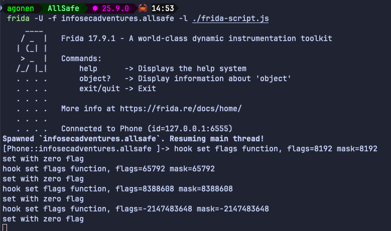
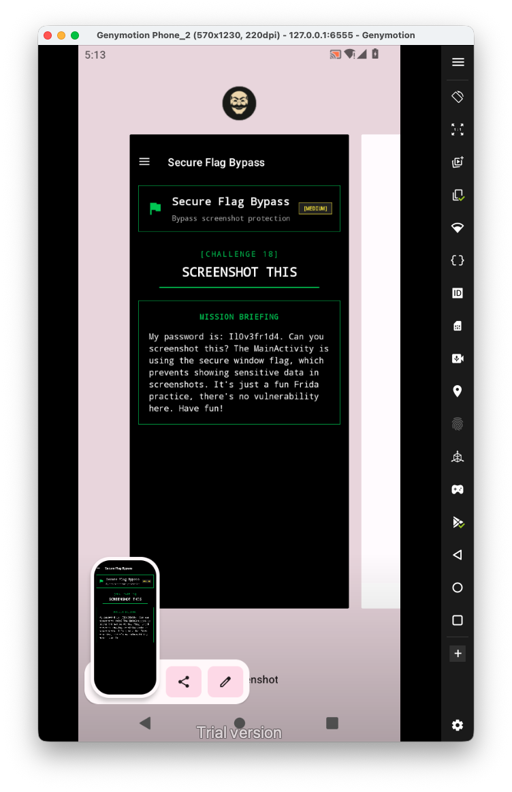

Let's first have a look at the challenge:



From what he says, there is some special flag that he putted inside `MainActivity.java`:



We can see the flag here, with the value `8192`, which equals to `0x00002000`, the value of the flag `WindowManager.LayoutParams.FLAG_SECURE`.

We can see that when we get to the background, it actually turn it black. In the same way it blocks screen shots.



Let's hook this function, and set it with flags 0:

```js
Java.perform(function(){
    Java.use("android.view.Window").setFlags.implementation = function(flags, mask){
        console.log(`hook set flags function, flags=${flags} mask=${mask}`);
        console.log('set with zero flag');
        this.setFlags(0,0);
    }  
})
```

Notice I'm using the `-f`flag, because I want to spawn the process with the hook, it needs to be run on the onCreate function, at the begin.



Now we are able to do screen shots:

