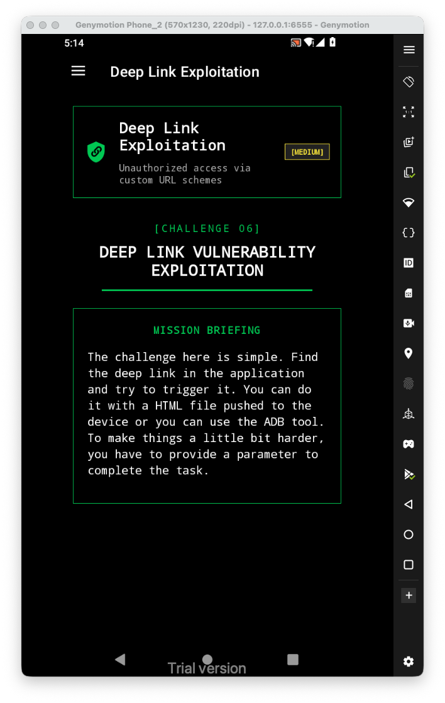
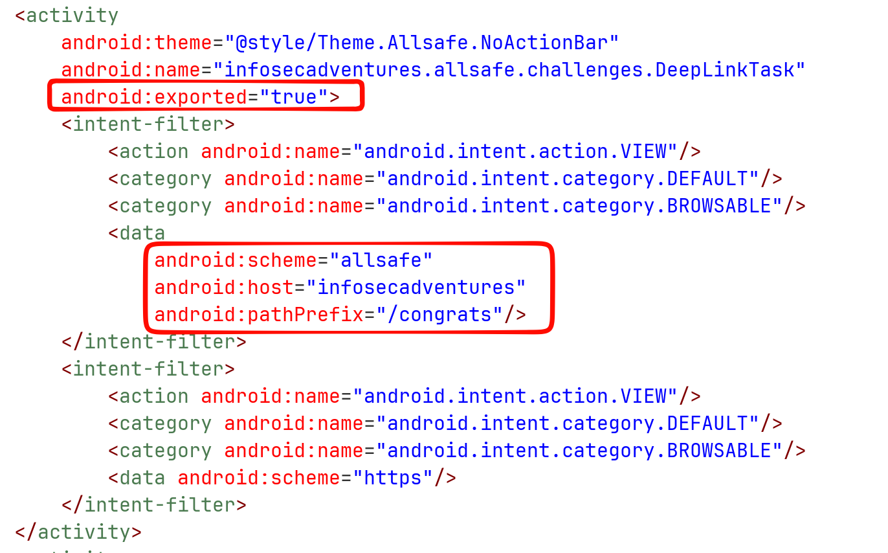
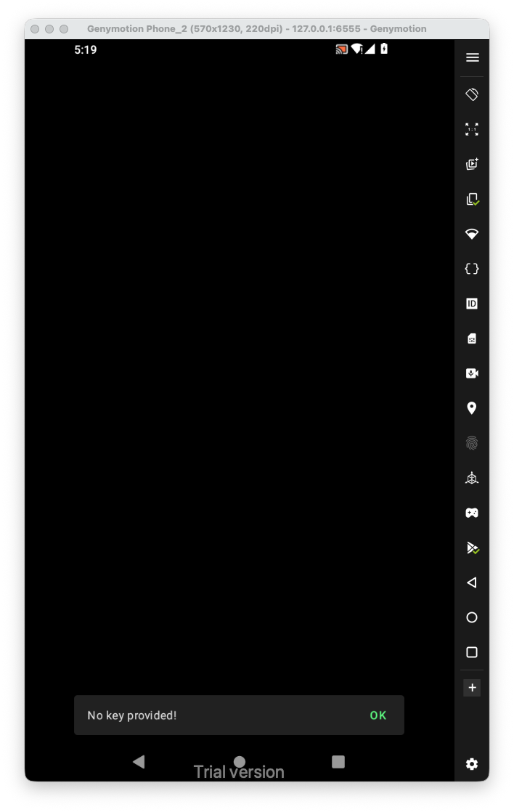
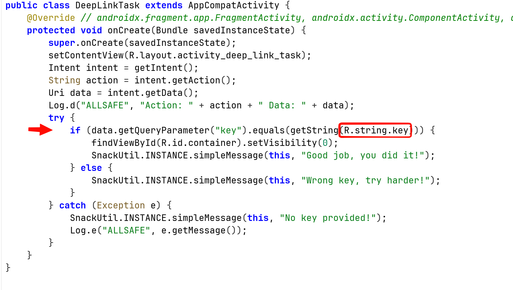
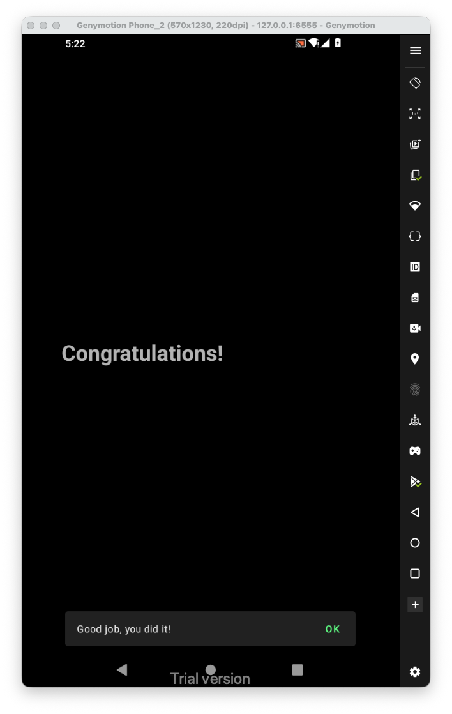

Let's first have a look at the challenge:



Inside `AndroidManifest.xml`, we can see the activity `DeepLinkTask` is exported, and that it has some data, which its form is like `allsafe://infosceadventures/congrats`:



Let's send this request with adb:

```bash
adb shell am start -a android.intent.action.VIEW -d "allsafe://infosecadventures/congrats"
```



It says "no key provided", let's check the code itself:



It checks for parameter named `key`, and compared the value with some value from `values/strings.xml`:


So, the value is `ebfb7ff0-b2f6-41c8-bef3-4fba17be410c`.
The full new deep link url will be:

```
allsafe://infosecadventures/congrats?key=ebfb7ff0-b2f6-41c8-bef3-4fba17be410c
```



