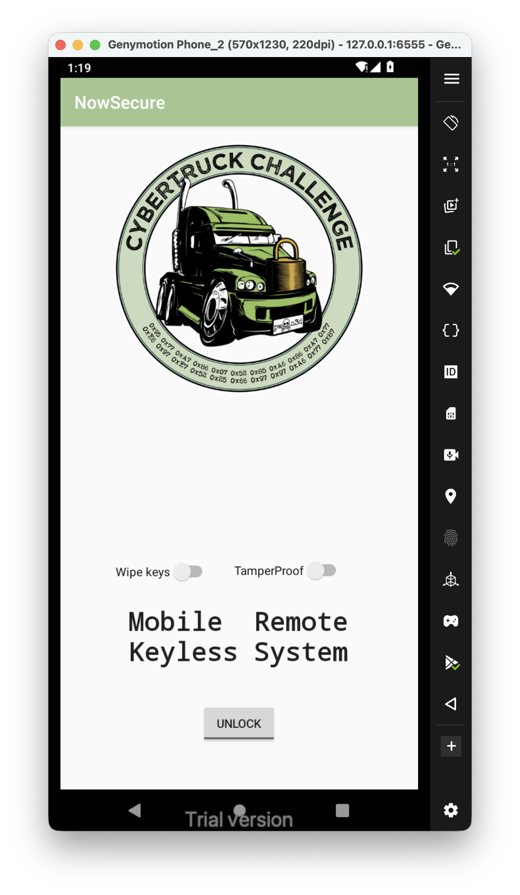
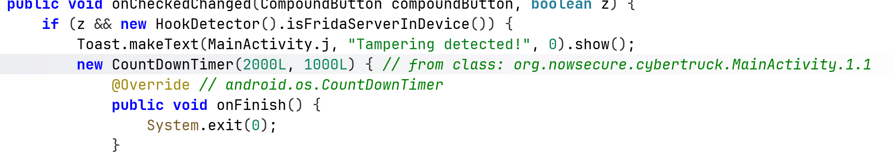
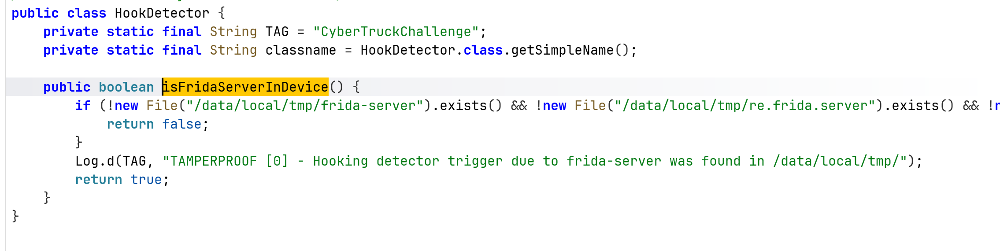

First, we download the binary from [https://github.com/nowsecure/cybertruckchallenge19/tree/master/apk](https://github.com/nowsecure/cybertruckchallenge19/tree/master/apk).

Now, let's install it on our emulator using adb:

```bash
adb install cybertruck19.apk
```

We can now first examine the `AndroidManifest.xml`:

```xml
<activity android:name="org.nowsecure.cybertruck.MainActivity">  
            <intent-filter>  
                <action android:name="android.intent.action.MAIN"/>  
                <category android:name="android.intent.category.LAUNCHER"/>  
            </intent-filter>  
        </activity>
```

We have one activity, and the package name is `org.nowsecure.cybertruck`.

Alright, let's open the app:


I tried to turn on the `TamperProof`, and got Toast and after that it closes the app. 
Alright, I check the code, and find the antiDebug functionallity, inside `HookDetector`:



and this is the function that does the detection:



Let's hook this function using this code:

```js
Java.perform(function(){
    bypassHookDetection();
});

function bypassHookDetection() {
    var HookDetector = Java.use("org.nowsecure.cybertruck.detections.HookDetector");
    HookDetector.$new(); // force init

    HookDetector.isFridaServerInDevice.implementation = function() {
        console.log("Frida detection bypassed");
        return false;
    }
}
```

Notice, this time we attach to the application after it already running, we now spawn it on our own because the `frida` don't manage to attach to it:

```bash
frida -U -N org.nowsecure.cybertruck -l ./frida-script
```


Now, we can find the first flag hardcoded inside the function `generateDynamicKey`:

```Java
protected byte[] generateDynamicKey(byte[] bArr) throws InvalidKeySpecException, NoSuchPaddingException, NoSuchAlgorithmException, InvalidKeyException {  
        SecretKey secretKeyGenerateSecret = SecretKeyFactory.getInstance("DES").generateSecret(new DESKeySpec("s3cr3t$_n3veR_mUst_bE_h4rdc0d3d_m4t3!".getBytes()));  
        Cipher cipher = Cipher.getInstance("DES");  
        cipher.init(1, secretKeyGenerateSecret);  
        return cipher.doFinal(bArr);  
    }  
  
    protected void generateKey() {  
        Log.d(TAG, "KEYLESS CRYPTO [1] - Unlocking carID = 1");  
        try {  
            generateDynamicKey("CyB3r_tRucK_Ch4113ng3".getBytes());  
        } catch (InvalidKeyException | NoSuchAlgorithmException | InvalidKeySpecException | BadPaddingException | IllegalBlockSizeException | NoSuchPaddingException e) {  
            e.printStackTrace();  
        }  
    }
```

The first flag is **`s3cr3t$_n3veR_mUst_bE_h4rdc0d3d_m4t3!`**.

The second flag can be achieved using this code:

```js
function getDynamicFlag() {
    Java.use("org.nowsecure.cybertruck.keygenerators.Challenge1").generateDynamicKey.implementation = function (bArr) {
        console.log("Inside generateDynamicKey function");
        let result = this["generateDynamicKey"](bArr);
        console.log("Generated dynamic key: " + toHexString(result));
        return result;
    };
}

function toHexString(byteArray) {
    return Array.from(byteArray, function(byte) {
        return ('0' + (byte & 0xFF).toString(16)).slice(-2);
    }).join('');
}
```

Of course, don't forget to call the function `getDynamicFlag` inside the `Java.perform` function. 
Then, when clicking the unlock, we can get the flag:


Notice, we can achieve the flag also by not clicking:

```js
Java.perform(function(){
    bypassHookDetection();

    getDynamicFlag();
    
    Java.use("org.nowsecure.cybertruck.keygenerators.Challenge1").$new();
});
```

So, the flag in hex is: **`046e04ff67535d25dfea022033fcaaf23606b95a5c07a8c6`**.

----

For the second part, the code is found at `org.nowsecure.cybertruck.keygenerators.a`, we can see the key is obtained from a file, located at `/assets/ch2.key`:


This isn't secured, let's simply go there and grab the key, which is **`d474_47_r357_mu57_pR073C73D700!!`**


We'll use this function:

```js
function getDynamicFlag2() {
    Java.use("org.nowsecure.cybertruck.keygenerators.a").a.overload('[B', '[B').implementation = function (bArr, bArr2) {
        console.log("Inside a.a function");
        let result = this["a"](bArr, bArr2);
        console.log("a.a result: " + toHexString(result));
        return result;
    }
}
```


The dynamic flag is **`512100f7cc50c76906d23181aff63f0d642b3d947f75d360b6b15447540e4f16`**

____

In part3 we can notice that the function is native function, loaded from `libnative-lib.so`, it loads the function `init`:


Okay, now let's load this library into `ghidra`, I'm loading the arm version, because it decompiles it better than the x86 version.

This is the decompiled init function we want to explore:


I renamed several variables, let's access the hardcoded_key:


Okay, so the first flag is **`Native_c0d3_1s_h4rd3r_To_r3vers3`**.

Next, we can see the decryption method, where it xor the 32 key with some secret, and at the end the flag located inside "flag3":


Okay, we need to somehow hook the function using frida, and try somehow to access the location of the flag itself, which can be accessed from the stack.

The function we want to hook is `Java_org_nowsecure_cybertruck_MainActivity_init`, let's try it.

First, I want to hook the whole function, and onEnter I want to hook the strlen and read 0x20 bytes from its `args[0]`.

Let's do it:

```js
function isAddressInModule(moduleName, address) {
  var module = Process.findModuleByName(moduleName)
  return address >= module.base && address < module.base.add(module.size);
}

function hookInit(){
    const init_address = Process.findModuleByName("libnative-lib.so").findExportByName("Java_org_nowsecure_cybertruck_MainActivity_init");
    Interceptor.attach(init_address, {

        onEnter: function(args){
            this.strlenAddr = Process.findModuleByName("libc.so").findExportByName("strlen");
            this.strlen = Interceptor.attach(this.strlenAddr, {
                onEnter: function(args) {
                    // Check if the return address of strlen is within libnative-lib.so to ensure we're only logging calls from that module.
                    if(isAddressInModule('libnative-lib.so', this.returnAddress)) {
                        console.log("Challenge 3 hardcoded key: "+ args[0].readUtf8String(32));
                    }
                }
            });
        }
    })
}
```

Now, we can see that we actually get the hardcoded flag:


Okay, next we want to hook the address of the local variable `flag` that is found on the local stack:


So, in our case we need to access the address of stack location - 0xa8.

I tried to add this onLeave function to the hooked init function:

```js
onLeave: function(){
            this.strlen.detach(); // Detach the strlen hook when leaving init to avoid detection
            const flag_address = this.context.sp.sub(0xa8);
            console.log("Flag address: " + flag_address);
            console.log("Flag value: " + flag_address.readUtf8String());
            console.log(hexdump(flag_address, {
                offset: 0,
                length: 0x100,
                header: true,
                ansi: true
             }) );
        }
```

However, it isn't working for some reason.

So, another way we can use is to hook specific line of code, and then access specific register, using this.context.

In our case, we would like to hook the line where it finish calculating the flag, and read the content of the register:


So, this will be the code:

```js
Interceptor.attach(Process.findModuleByName("libnative-lib.so").base.add(0x808), {
        onEnter: function(args) {
        // Print the value of x8
        console.log('x8: ' + this.context.x8.readUtf8String(10));
    }  
    });
```

After day of working, I don't know what to do :(

