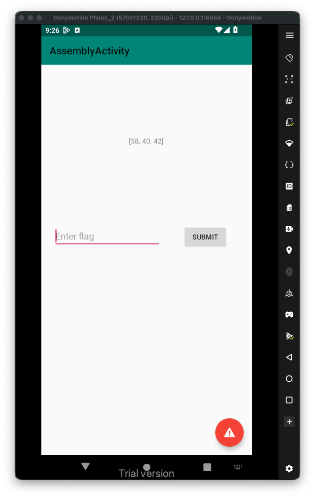
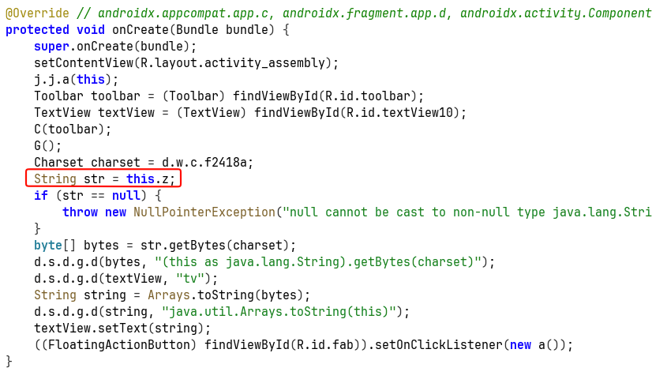
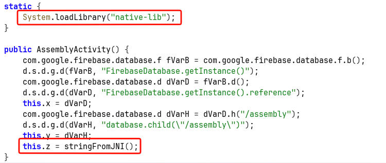
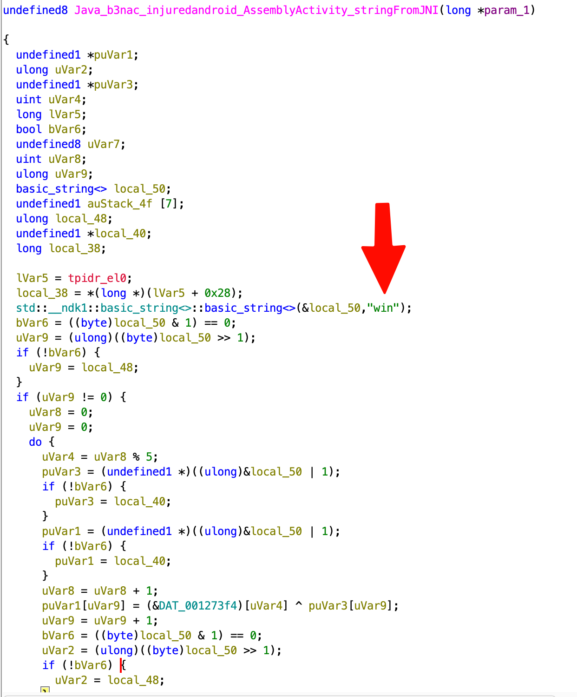
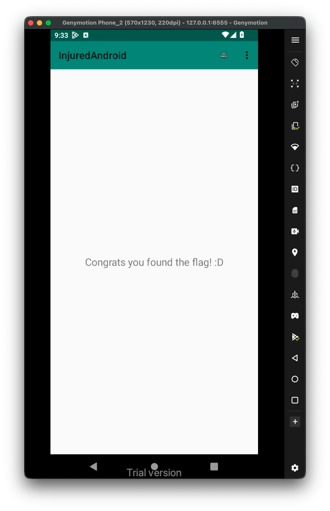

When we access the challenge, we can see this list:

I checked the source code of the `AssmebleActivity.java`:

We can see here the `this.z`, which is used to display the encrypted list.

Let's check where it comes from:

We can see this is native function from the file `libnative-lib.so`, let's load this file to *Ghidra*.

The `win` string is very interesting, let's try it:

