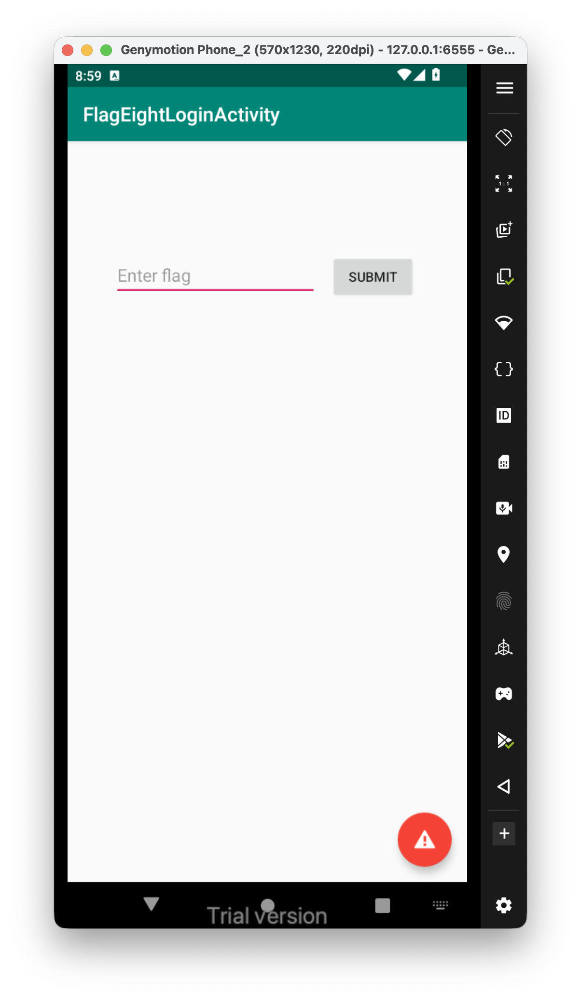
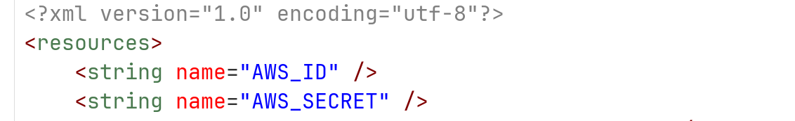
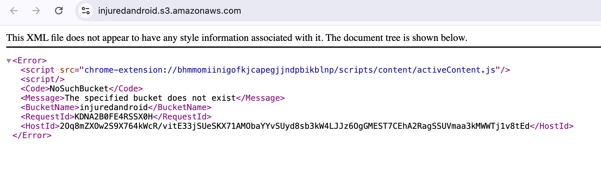
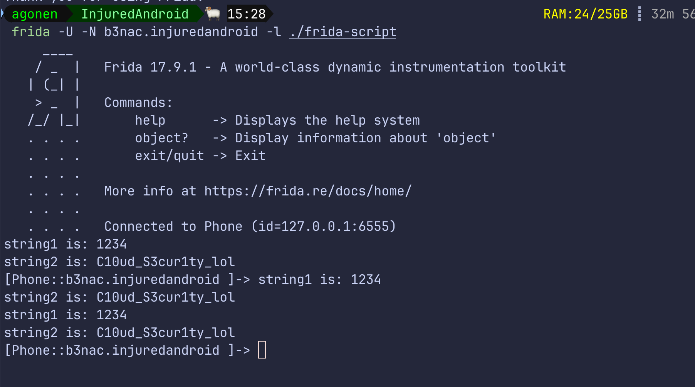

In this challenge we need to give some password:


This challenge is broken. 
The idea was to first look at the `strings.xml`:



Then, we can see that there are no credentials for the aws bucket, probably some s3 bucket.

Next step will be to check for some bucket, we'll use the tool [https://github.com/initstring/cloud_enum](https://github.com/initstring/cloud_enum), which we'll do the s3 enum:

```bash
python3 cloud_enum.py -k injuredandroid
```

However, we can't find any bucket. 
I checked on writeup's, and saw I need to find the bucket `https://injuredandroid.s3.amazonaws.com/`, which isn't exist anymore:



After finding the s3 bucket, we'll use aws cli with no profile to access this bucket:

```bash
aws s3 ls s3://injuredandroid.s3.amazonaws.com/ --no-sign-request
```

So, sadly we'll need to hook the compare function and find the flag, not on the intended way.

```js
Java.perform(function (){
    Java.use("d.s.d.g").a.implementation = function(str1, str2){
        if(str1 == '1234' || str2 == '1234'){
            console.log("string1 is: " + str1)
            console.log("string2 is: " + str2)
            return true;
        }
        return this.a(str1, str2);
    }

})
```



The flag is **`C10ud_S3cur1ty_lol`**.

