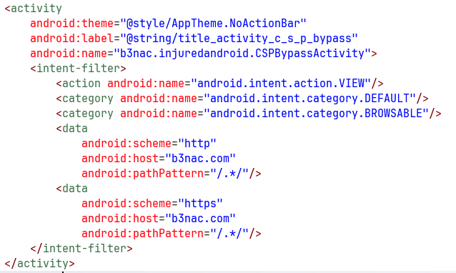
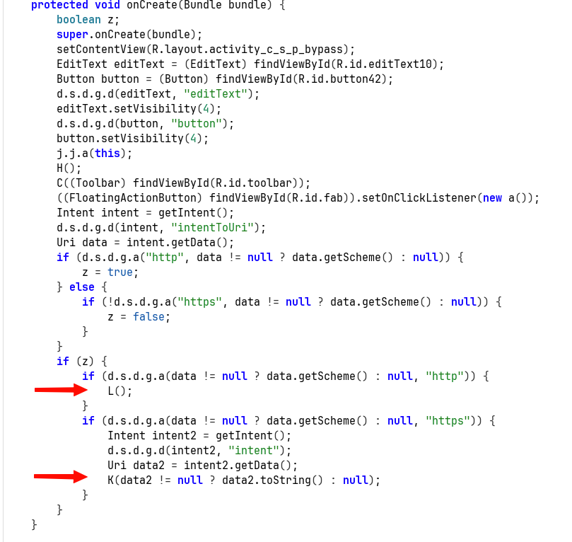
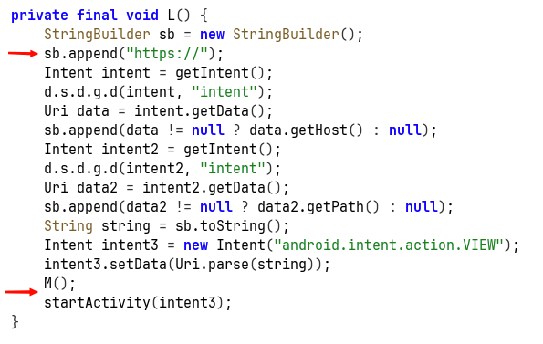
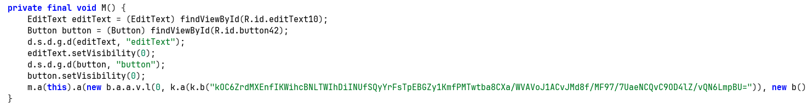
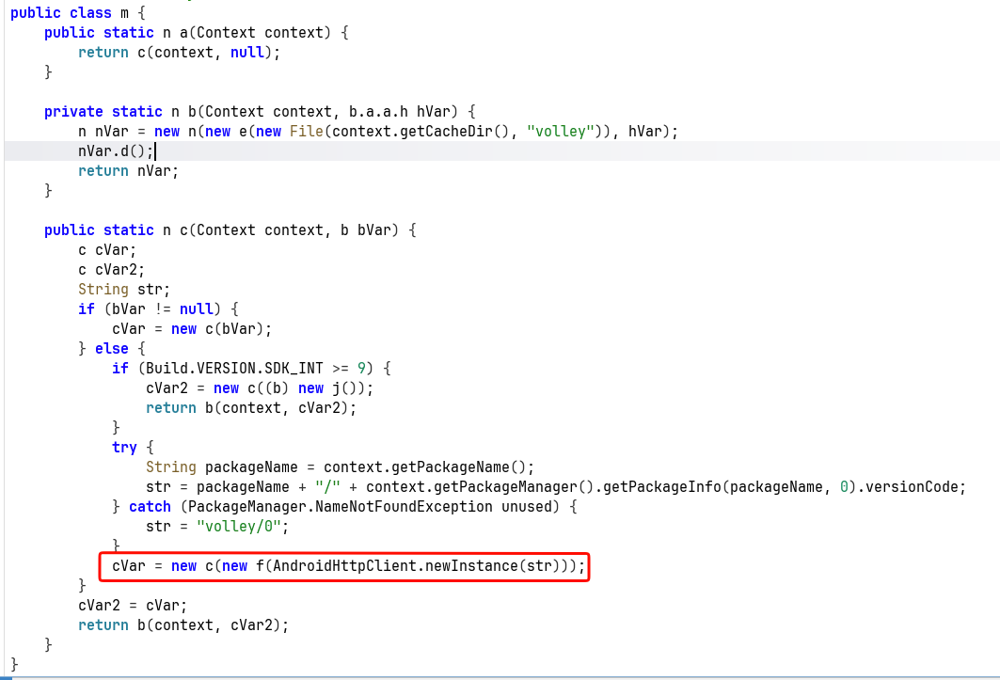
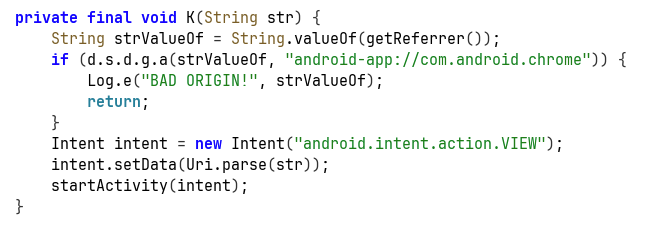
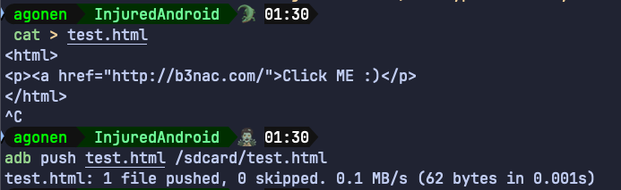
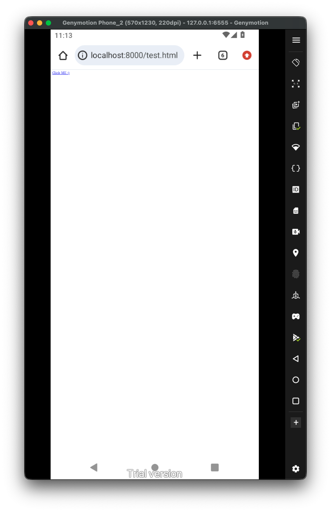
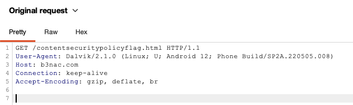
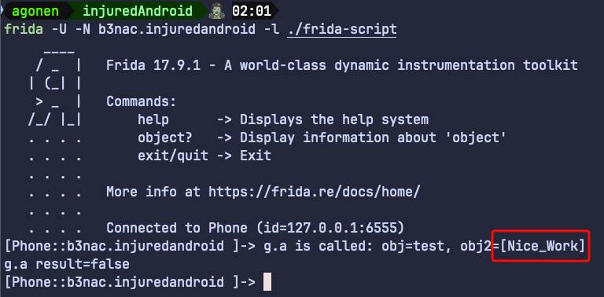

Let's check the `AndroidManifest.xml`:



We can see it filters the action `android.intent.action.VIEW` with the schema `http` or `https`, and the host `b3nac.com`.

In this challenge I setup my burp proxy, to view the request that are being sent. You can use the tool I created here [https://github.com/avishaigonen123/CTF_writeups/blob/master/stuff/emulator_tool.sh](https://github.com/avishaigonen123/CTF_writeups/blob/master/stuff/emulator_tool.sh).

Inside the `onCreate` function we can see it checks for the uri schema:



If it is `http`, then it sends it to the function `L`. Else, if it's `https`, it sends it to the function `K`.

This is the function `L`, which handle the `http` case:



It replace the uri schema to `https`, then call the function `M`, and lastly starts new activity with the modified intent.

The function `M` decrypts some DES encrypted string, and creates new request with this decoded value (which using dynamic hooking shows us it is an URL):



Here you can see it creates new request with this decrypted string:



Let's go back to what we saw in the begin, there is the function `K`, which comes in situation where the schema is `https`:



It first checks if the referrer isn't `android-app://com.android.chrome`, means this is something that comes from clicking on deep link found on some website accessed by chrome browser. It comes here to prevent deep link clicking from malicious websites.

However, we can initiate request with `http`, and then there will be some sort of `SSRF`, where the application send a new message, which bypass this restrictions since new it comes from the package of the application, something like `android-app://b3nac.injuredandroid`.

Another way will be to initiate the request from `adb`, because then it will be `android-app://com.android.shell`.

Anyway, let's create our simple page with the `CSP` payload, and get the flag:

```html
<html>
<p><a href="http://b3nac.com/testing/">Click ME :)</p>
</html>
```



In general this should work, I create adb reverse port forwarding:

```bash
adb reverse tcp:8000 tcp:8000
```

Now, let's host this file in our host, I don't want to use WebView, rather on Chrome:

```bash
python3 -m http.server 8000
```

We can access the file on `http://localhost:8000/test.html`


Now, theoretically it should work. However, something with the intent filter isn't working well, maybe the globe in the path. 

So, we'll need to use explicit intent creation using `adb`, and start the activity:

```bash
adb shell am start -n "b3nac.injuredandroid/.CSPBypassActivity" -d 'http://b3nac.com/testing/'
```

There, we can see there was some request to `https://b3nac.com/contentsecuritypolicyflag.html`.



However, this website isn't exist anymore, so we'll need to "cheat" and hook the compare function:

```js
Java.perform(function (){
    var k = Java.use("b3nac.injuredandroid.k");
    k["a"].implementation = function (str) {
        console.log(`k.a is called: str=${str}`);
        let result = this["a"](str);
        console.log(`k.a result=${result}`);
        return result;
    };
})
```



So, the flag is **`[Nice_Work]`**