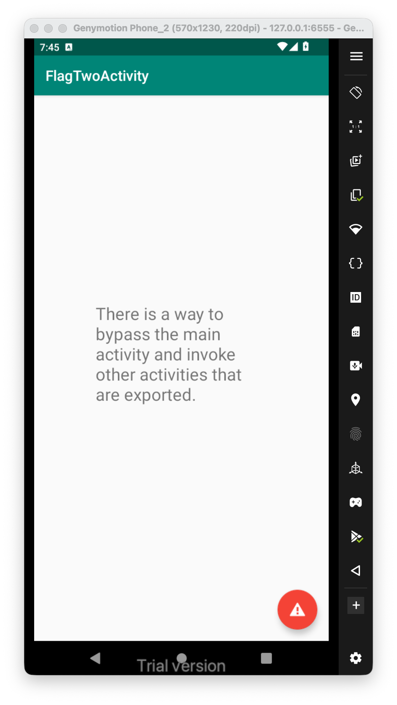
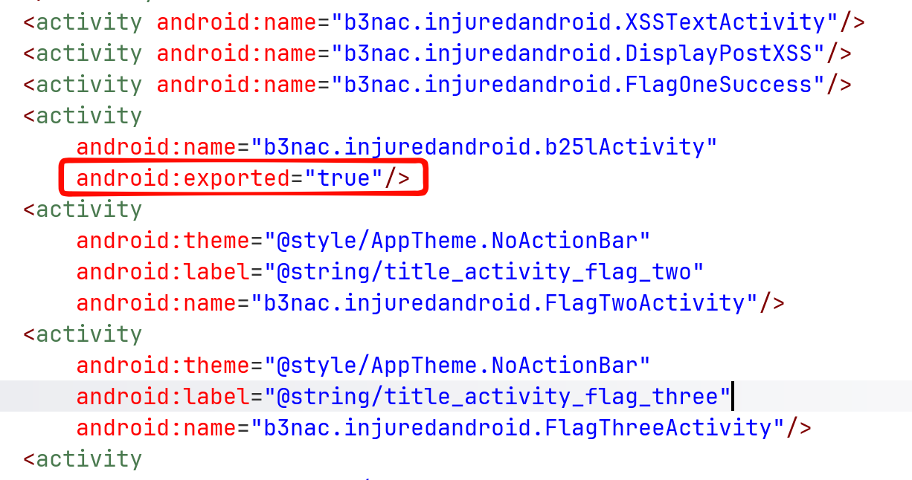
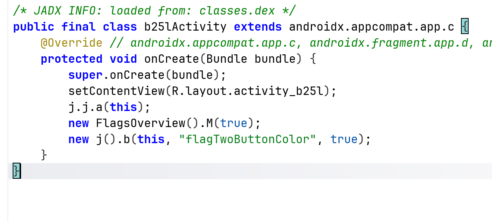
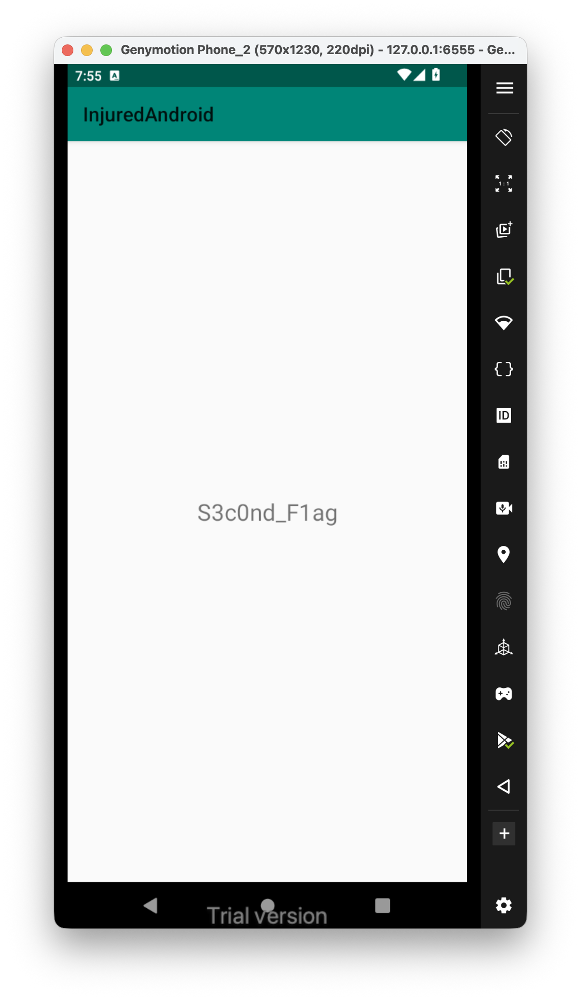

Let's enter the challenge:

The message says:
```
There is a way to bypass the main activity and invoke other activities that are exported.
```

I searched for activities I can export, using looking inside `AndoridManifest.xml`, and check if the activity has the attribute `exported=true` or has `intent-filter`.

We can find several activities, however, the one that dragged my attention is `b25lActivity`:



and this is the source code:



We need to create explicit intent with this activity:

```bash
adb shell am start -n "b3nac.injuredandroid/.b25lActivity"
```


So, the second flag is **`S3cOnd_F1ag`**.
