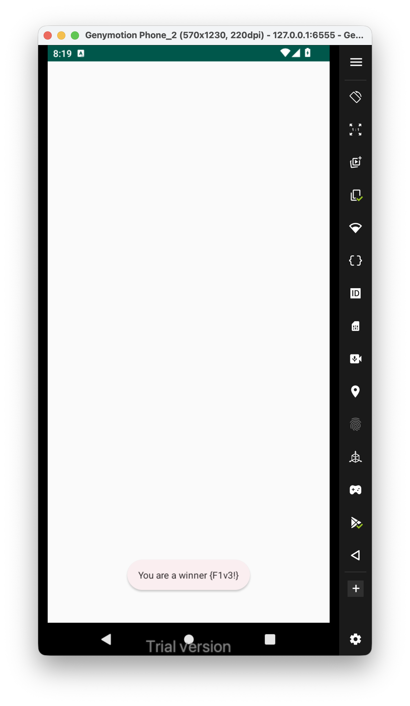
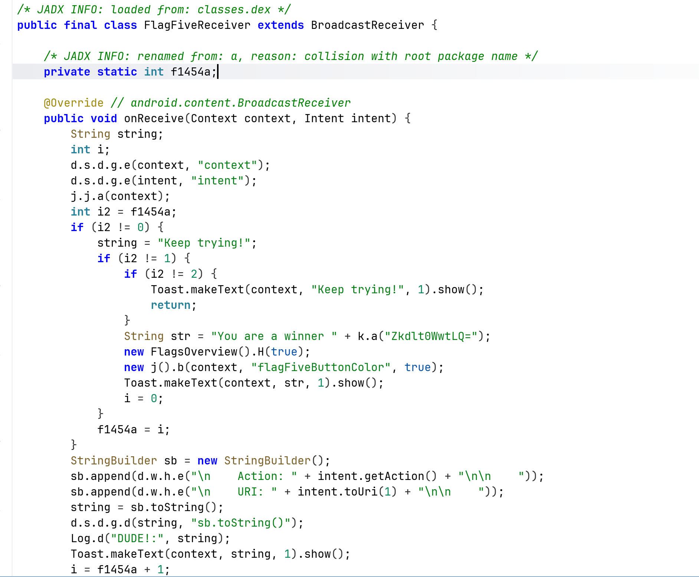
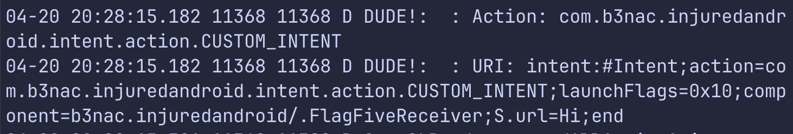
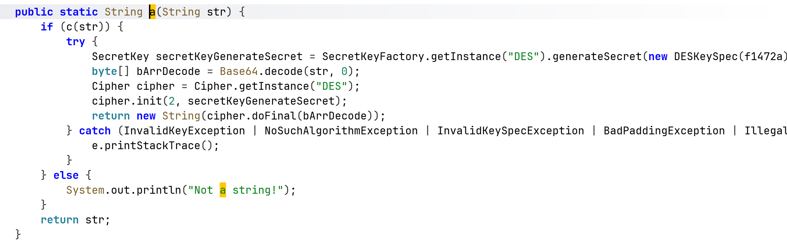
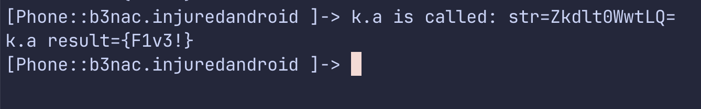

This is the challenge, that's what we get after summon this activity three times:


From the source code, we can see this is a broadcast exported receiver (from `AndoridManifest.xml`), that every 3 times prints the flag, which is `{F1v3!}`.



We can see it also log it as debug message, let's use logcat to read this specific logs from our application only:

```bash
adb logcat "*:D" --pid="$(adb shell pidof b3nac.injuredandroid)"
```



We can see the logs. In order to get the flag, I hooked the decrypt function, which used `DES` decryption:



This is the script:
```js
Java.perform(function (){
	var k = Java.use("b3nac.injuredandroid.k");
	k["a"].implementation = function (str) {
	    console.log(`k.a is called: str=${str}`);
	    let result = this["a"](str);
	    console.log(`k.a result=${result}`);
	    return result;
	};

})
```



