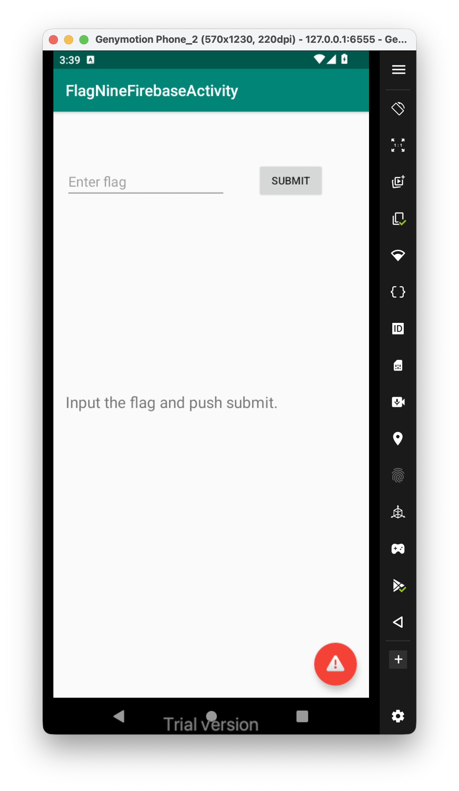
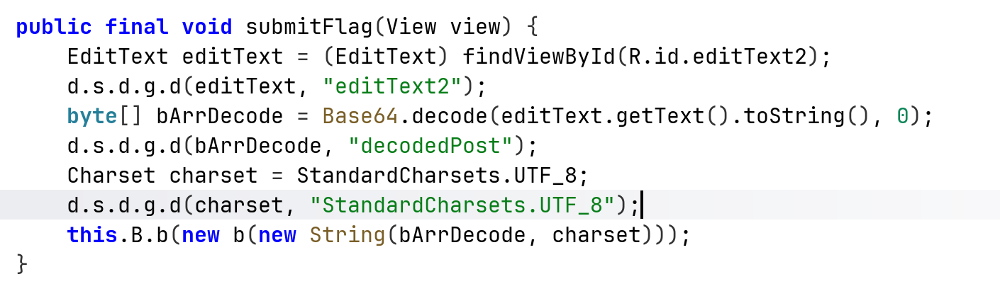
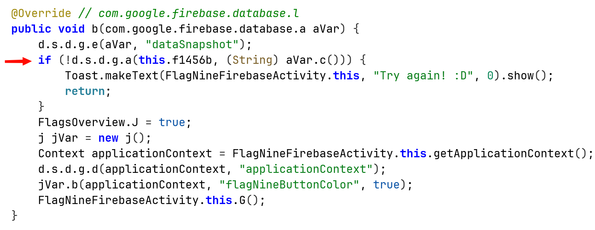
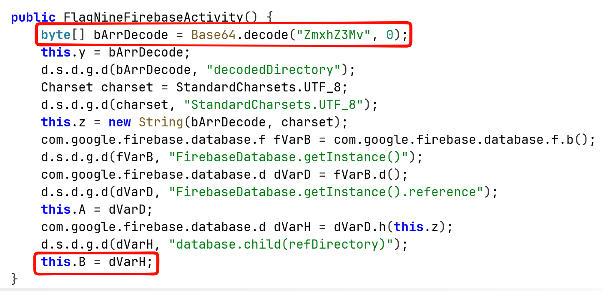
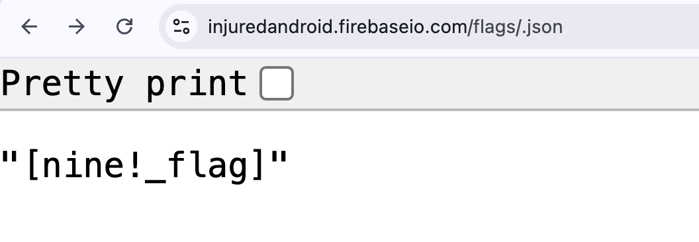
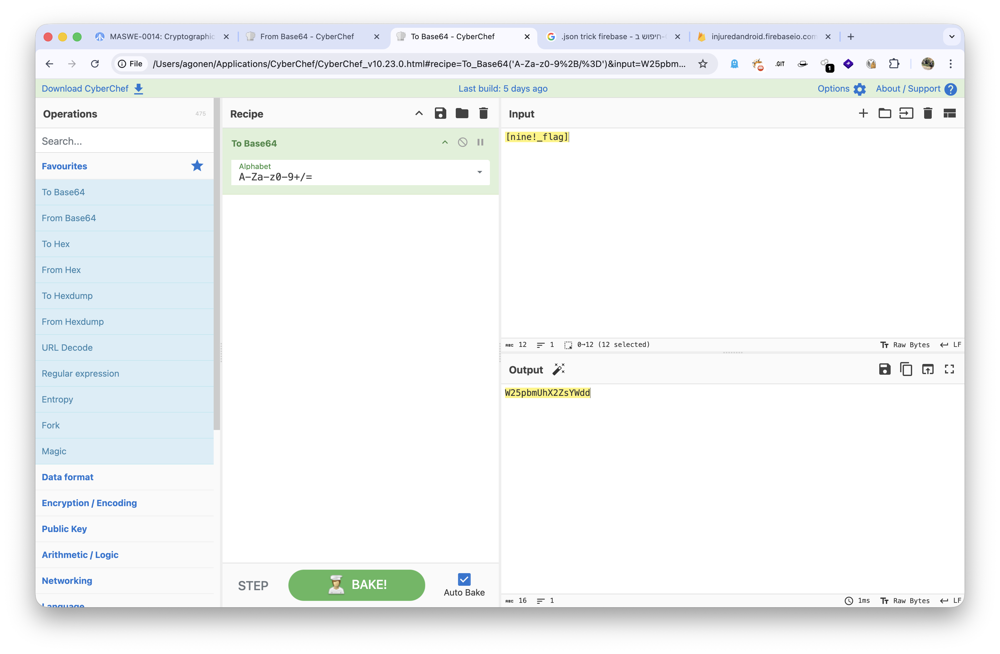

This is the challenge:


We can see it takes the input of the user, decode it in base64 form, and then send it to some function.



This is the function that compare the input with some value:



We can see that at the end of `submitFlag`, it uses the function of the instance `this.B`. 

In addition, we can see that in the constructor of the activity, it do something with `this.B`, put some value inside it:



It pulls something from the firebase, I guess this is something to do with the encoded base64, let's try to decode it: 


Okay, so the decoded value is `flags/`.
Inside `strings.xml`, we can find some url, that looks like firebase url:

```xml
<string name="firebase_database_url">https://injuredandroid.firebaseio.com</string>
```

So, I concated the values, and added `.json`:

```
https://injuredandroid.firebaseio.com/flags/.json
```



We got the flag **`[nine!_flag]`**, let's base64 encode it: **`W25pbmUhX2ZsYWdd`**:

