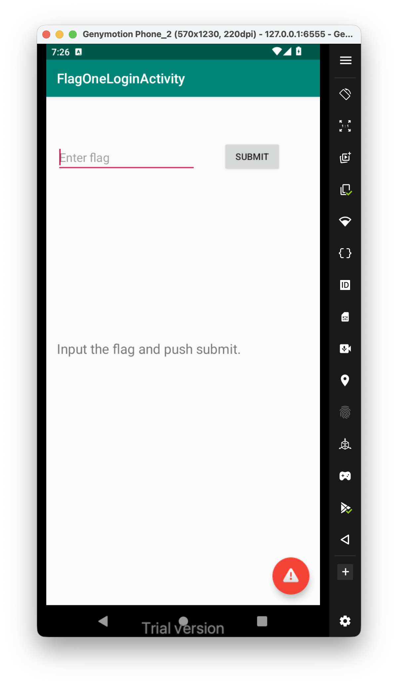
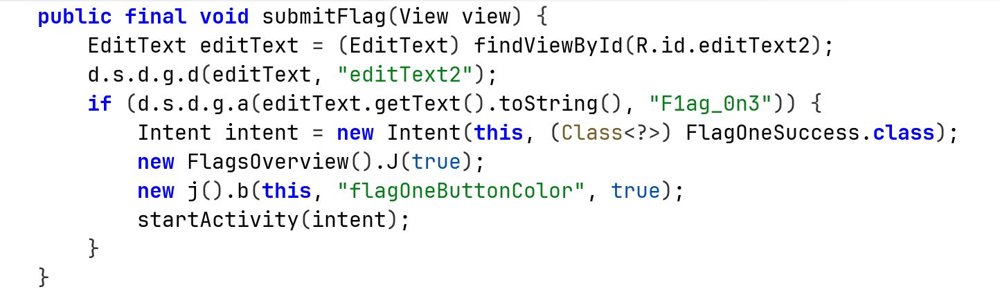
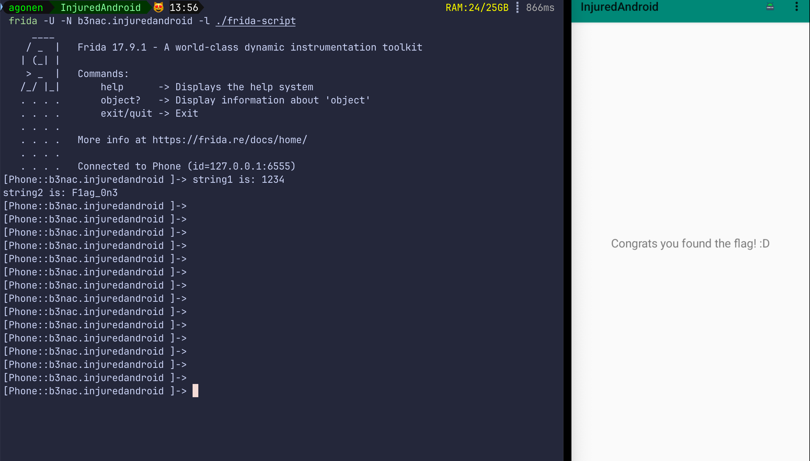

Let's enter the challenge:


And this is the code of the function that checks the flag entered:



We can see it execute the function `a` on the strings, this is the source code:

```java
public static boolean a(Object obj, Object obj2) {  
        return obj == null ? obj2 == null : obj.equals(obj2);  
    }
```

It looks like compare function. We now have 2 ways to success on this challenge, let's try to give the flag, which is **`F1ag_0n3`**.

Another way is to use `frida` and hook the compare function:
```js
Java.perform(function (){
    Java.use("d.s.d.g").a.implementation = function(str1, str2){
        if(str1 == '1234' || str2 == '1234'){
            console.log("string1 is: " + str1)
            console.log("string2 is: " + str2)
            return true;
        }
        return str1 == str2;
    }

    }
)
```



This is how we hook the frida script, notice I use `-N` because i want to use existing app, and not spawn a new one.

```bash
frida -U -N b3nac.injuredandroid -l ./frida-script
```

