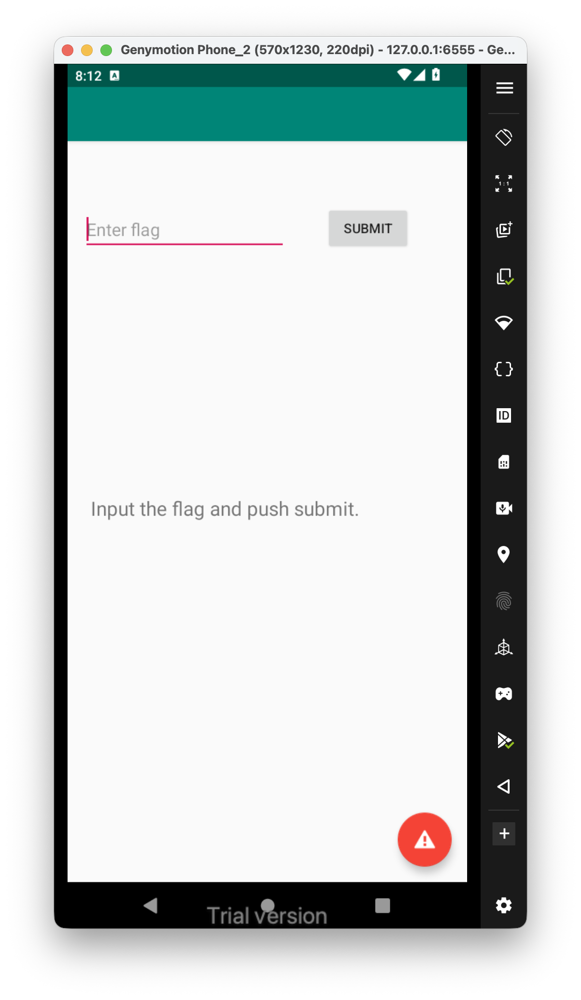
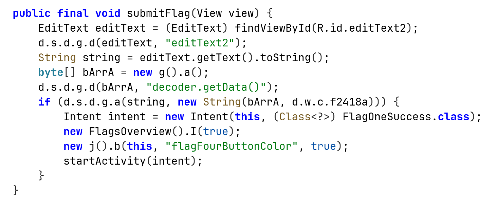
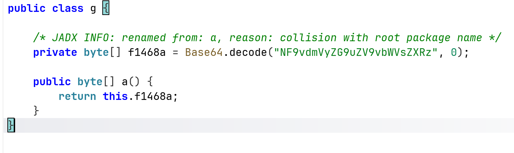
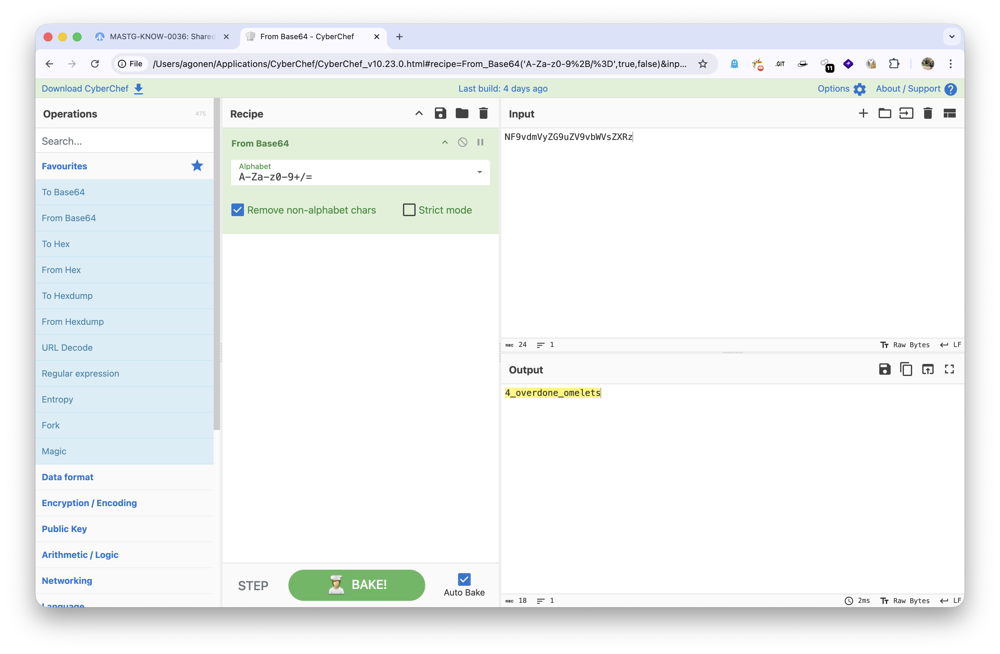
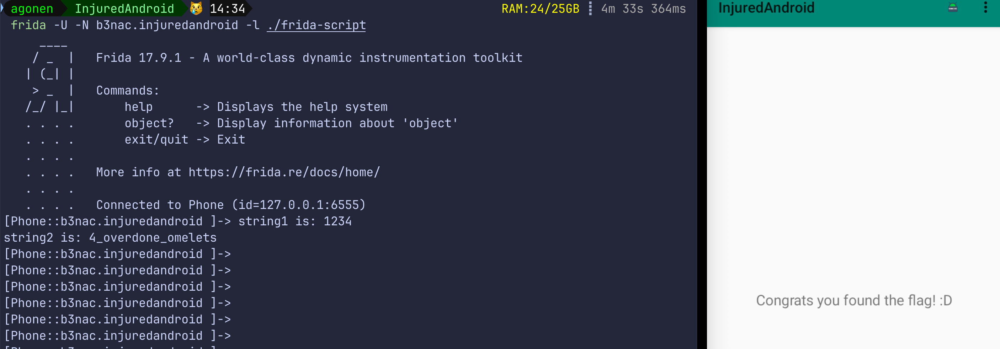

Let's check the challenge:



This is the source code of the `submitFlag`:



We can see it compares with some content it gets from the `new g().a()`, this is the source code:



It decodes the string `NF9vdmVyZG9uZV9vbWVsZXRz`, let's do it manually:



So, the flag is **`4_overdone_omelets`**.

Another way will be to use frida, same as we did on [Login](../Login/index.md).

This will be the frida script:

```js
Java.perform(function (){
    Java.use("d.s.d.g").a.implementation = function(str1, str2){
        if(str1 == '1234' || str2 == '1234'){
            console.log("string1 is: " + str1)
            console.log("string2 is: " + str2)
            return true;
        }
        return this.a(str1, str2);
    }

    }
)
```



