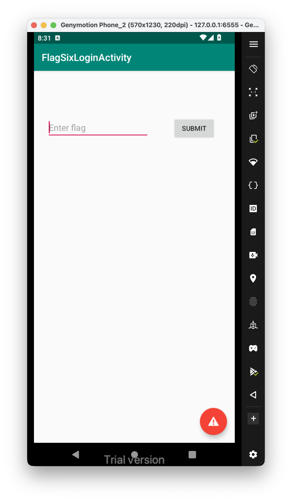
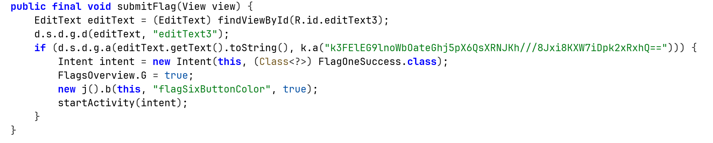
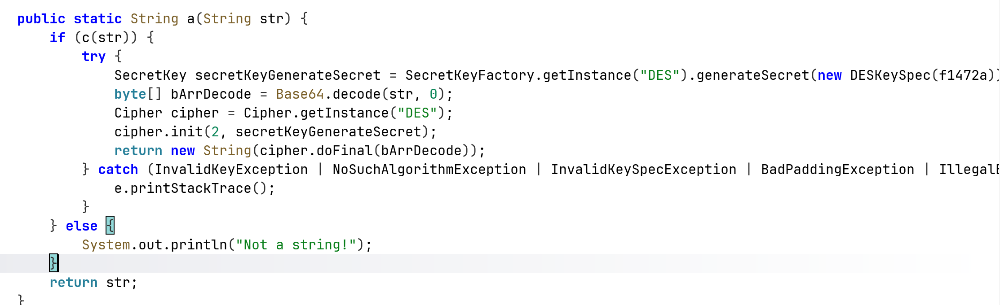
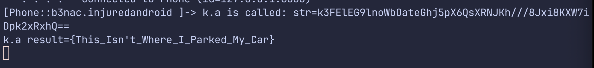

This is the challenge:


This is the `submitFlag` function:



It decodes the string `k3FElEG9lnoWbOateGhj5pX6QsXRNJKh///8Jxi8KXW7iDpk2xRxhQ==` which is base64 encoded, and also DES encrypted.



Let's hook this function using this frida script:

```js
Java.perform(function (){
	var k = Java.use("b3nac.injuredandroid.k");
	k["a"].implementation = function (str) {
	    console.log(`k.a is called: str=${str}`);
	    let result = this["a"](str);
	    console.log(`k.a result=${result}`);
	    return result;
	};

})
```



Okay, the flag is `{This_Isn't_Where_I_Parked_My_Car}`.

We could have hook also the compare function, using same method as on [Login](../Login/index.md).

