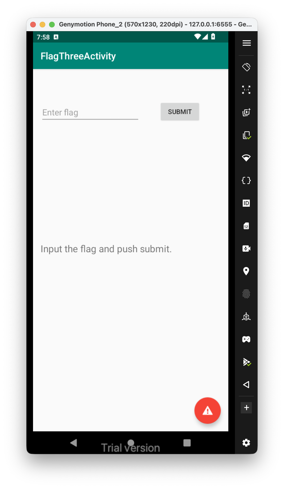
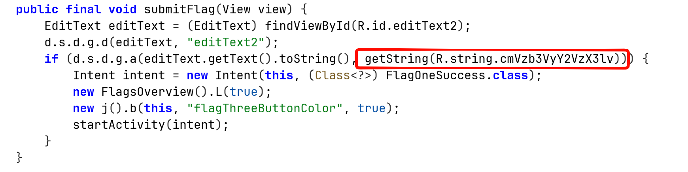
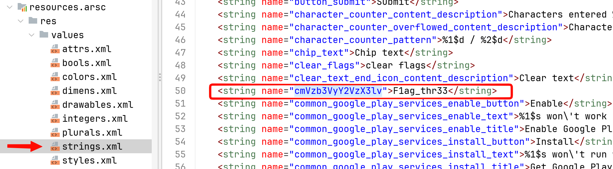

First, this is the challenge:

This is the code of the `submitFlag` function: 

We can see it compare the string we input, with the value of the key `cmVzb3VyY2VzX3lv`.

We can find the value inside `res/values/strings.xml`:

So, the flag is: **`F1ag_thr33`**.

Another way will be to use `frida`, same as we did [Login](../Login/index.md)