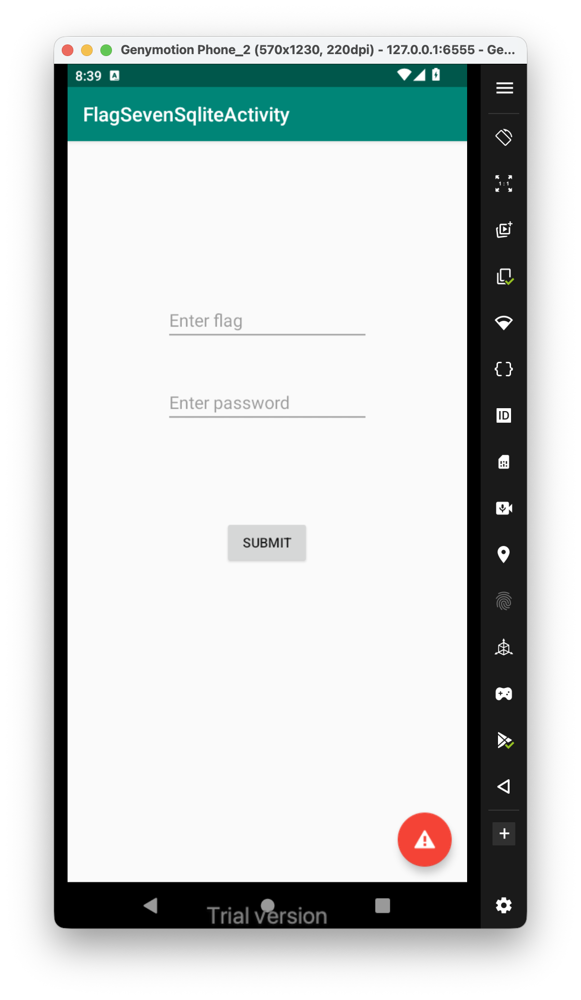
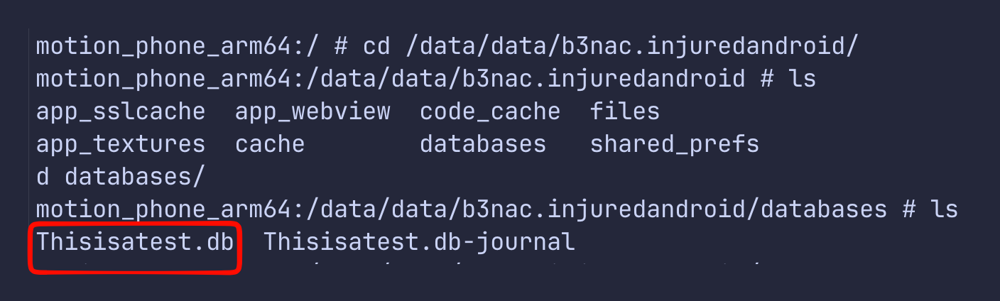
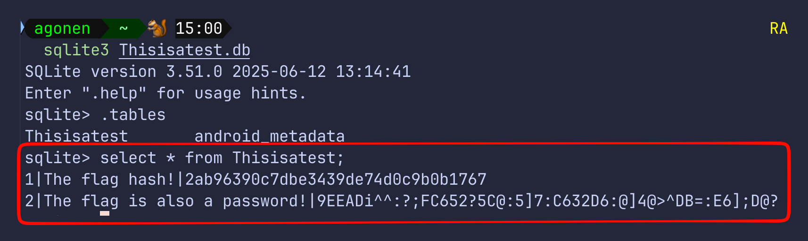
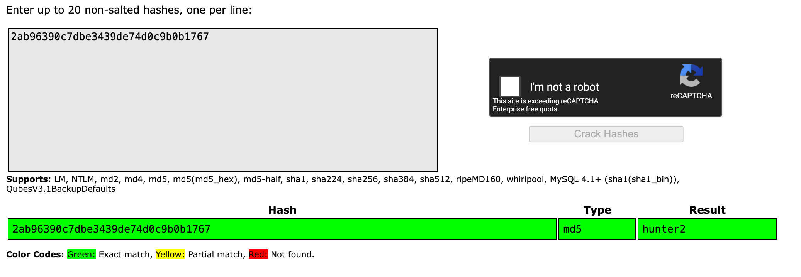
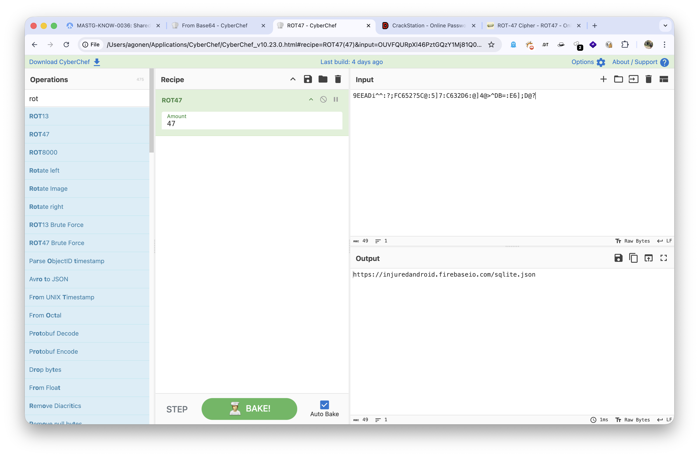
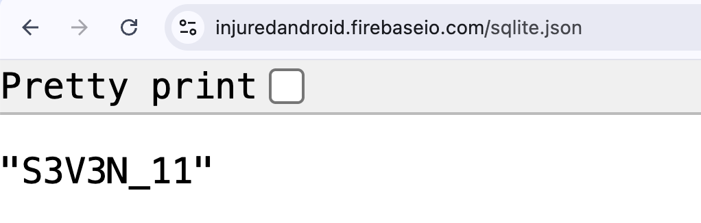
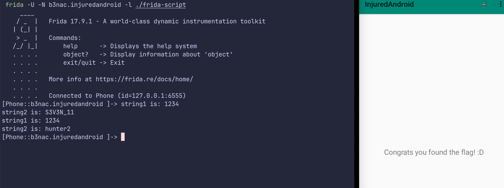

In this challenge, we need to give password and flag:


We know this is something about sqlite, which is sql database, let's go to the internal storage of the application and search for the databases.

I checked the local storage of the application, we can see the database `Thisisatest.db`:



Let's download this db, using the pull command:

```bash
adb pull /data/data/b3nac.injuredandroid/databases/Thisisatest.db ./Thisisatest.db
```

Next, we'll check if this db has some interesting tables and data:



```
sqlite> select * from Thisisatest;
1|The flag hash!|2ab96390c7dbe3439de74d0c9b0b1767
2|The flag is also a password!|9EEADi^^:?;FC652?5C@:5]7:C632D6:@]4@>^DB=:E6];D@?
```

The flag hash can be cracked easily, at [https://crackstation.net/](https://crackstation.net/):



So, the flag is **`hunter2`**

Using CyberChef and `ROT47`, I got some URL from the second string:


The url is `https://injuredandroid.firebaseio.com/sqlite.json`, let's go there:



So, we the flag password is **`S3V3N_11`**

Another way will be to use the same method as shown at [Login](../Login/index.md)



