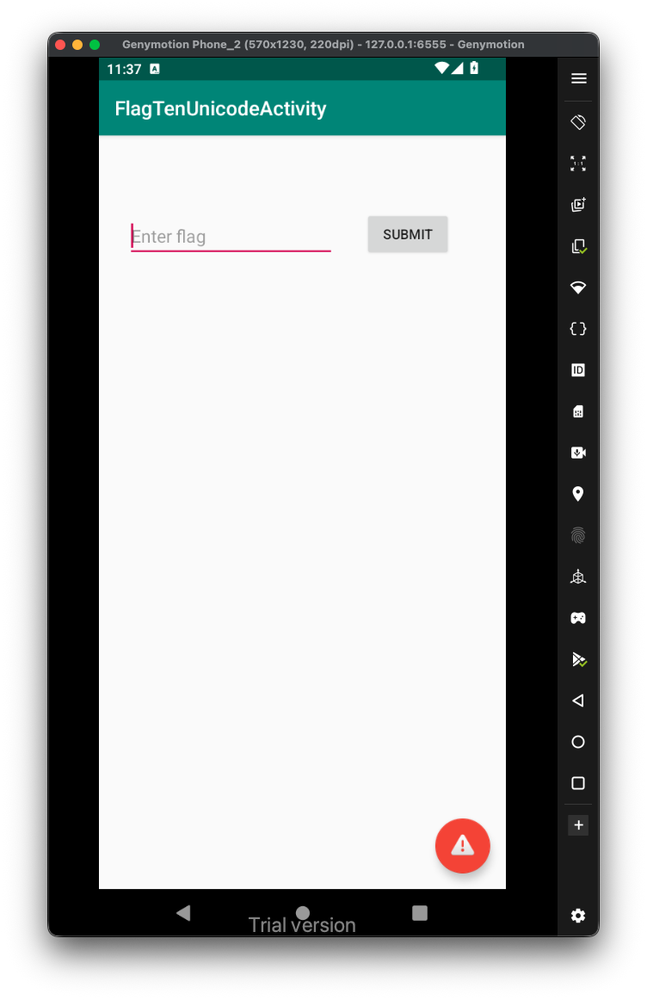
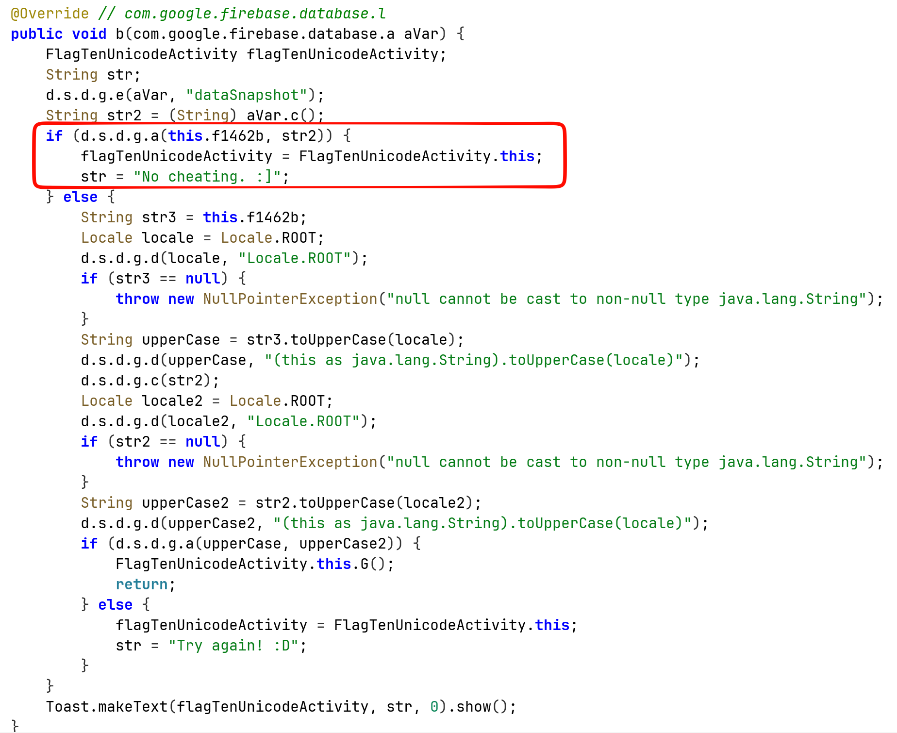
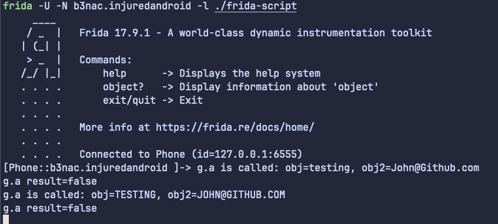
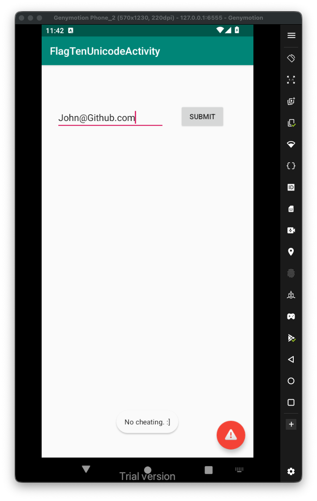

This is the challenge:

After some navigation, I found this function. Let's hook this compare function and check its values.



We'll use this script:

```js
Java.perform(function (){
   var g = Java.use("d.s.d.g");
    g["a"].implementation = function (obj, obj2) {
    console.log(`g.a is called: obj=${obj}, obj2=${obj2}`);
    let result = this["a"](obj, obj2);
    console.log(`g.a result=${result}`);
    return result;
};

})
```

And this, hook this script:

```bash
frida -U -N b3nac.injuredandroid -l ./frida-script
```



We can see it compares the value given with `John@Github.com`, then it gets false, and continue to next comparison, this time upper case.

I tried to give the string `John@Github.com`, and got this toast message says no cheating:



Okay, we need to give some string that is not equal to `John@Github.com`, and then, when getting upper case, equal to `JOHN@GITHUB.COM`.

One way will be to give something like `JOHN@github.com`. 
Another way is to user [https://dev.to/jagracey/hacking-github-s-auth-with-unicode-s-turkish-dotless-i-460n](https://dev.to/jagracey/hacking-github-s-auth-with-unicode-s-turkish-dotless-i-460n), which gives us unicode collision using turkish dotless `ı`, so, let's give this string: `John@Gıthub.com`.

